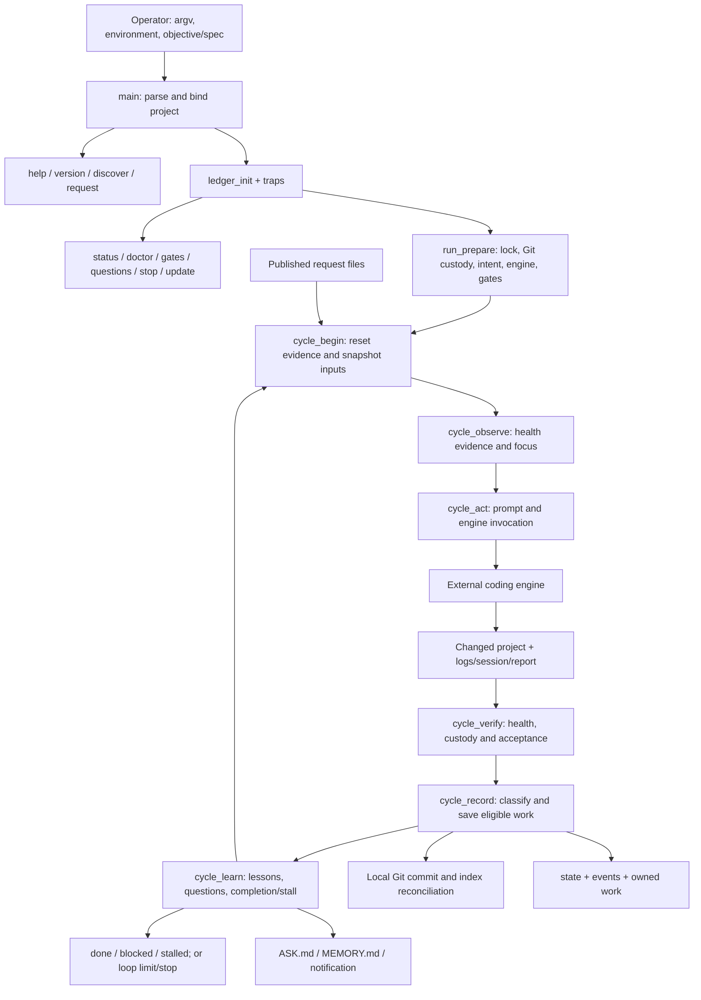

# Ralphie: source comprehension map

**Ralphie is a persistent supervisor around an external coding engine.** It selects work, supplies context, invokes the engine, independently measures configured checks, protects operator work, records what happened and resumes. The engine performs the code development. Ralphie controls what evidence permits saving and completion.

This review covers all **5,478 lines and 234 function definitions** in the working copy, including two local discovery overrides and the nested request archive helper. It is bound to version **3.1.0**, SHA-256 **`c21744b635e3b640aa6d65b6c36daa7dc0d8e1e90b7bf45fb09f8937055aa905`**. The checkout was already modified; Git HEAD `04dc8eff299b8535ad0ef676295bba1ebcb9fca3` alone does not identify these bytes.

The source was divided into three independent reviews covering lines 1–1696, 1697–3161 and 3162–5478. An independent Bash syntax index was reconciled with all three. This is comprehensive static source coverage, not proof of all runtime behaviors or arbitrary project correctness. No product code, project gates, engines or update candidates were executed for this map.

## Navigate

| Artifact | Use |
|---|---|
| [Interactive graph](graph.html) | Search functions, expand directed relationships, switch between calls and all I/O/state, inspect contracts and jump to source. Works offline. |
| [Frozen source](source.html) | Every source line, with stable `#L123` anchors tied to the review hash. |
| [Inputs and outputs](INPUTS_OUTPUTS.md) | CLI, environment, files, process boundaries, protocols, default limits and return codes. |
| [Function catalogue](FUNCTIONS.md) | All 234 definitions, grouped by source layer. |
| [Function contracts](function-inventory.json) | Machine-readable inputs, outputs, effects, failure/recovery and callbacks for every definition. |
| [Raw source index](source-index.json) | All indexed command sites, redirects, assignments, variable expansions, case branches and heredocs. |
| [Graph data](graph.json) | Directed NetworkX node-link graph; edges are under `links`, with source evidence. |
| [Coverage](coverage.json), [manifest](map-manifest.json), [graph diagnostics](graph-health.json) | Exact source binding and structural checks. |
| [Core, ledger and gates](core_ledger_gates.review.md), [Git and engines](git_engine.review.md), [loop, human and interface](loop_human_interface.review.md) | Detailed source reviews, including limitations and top-level execution. |

## The architecture

One Bash process owns the control loop. Most cross-function results travel through mutable shell globals or files; stdout and return codes supply narrower interfaces. Bash dynamic scope and subshell boundaries are therefore architectural constraints. There is no object model, dependency injection container or external runtime module required by the script.

The seven layers are source organization, not isolated modules. Calls cross both directions: gate supervision uses the engine-layer watchdog, and lower layers emit questions through the human layer. This is valid because normal execution begins after all definitions are loaded.

| Layer | Source | Responsibility | Main boundaries |
|---|---:|---|---|
| Bootstrap | [1](source.html#L1) | Persist a streamed invocation, establish strict shell mode and defaults. | stdin, script path, argv, process replacement |
| CORE | [89](source.html#L89) | Portable output, predicates, digests, tokens, time and budget primitives. | stdout/stderr, OS utilities, clock/random source |
| LEDGER | [282](source.html#L282) | State/events, recovery, retention, locks, freshness and child cleanup. | `.ralphie/`, filesystem, PIDs/signals |
| PROJECT | [919](source.html#L919) | Stack/gate discovery, gate execution/custody, Git ownership and commits. | project manifests, shell checks, Git index/refs/hooks |
| ENGINE | [2506](source.html#L2506) | Capability table, selection, argv, attempts, fallback, watchdog and usage. | installed agent CLI, prompt/capture/session files |
| LOOP | [3162](source.html#L3162) | Objective/acceptance, context, six phases, outcomes, learning and stop policy. | shared cycle evidence and durable intent |
| HUMAN | [4314](source.html#L4314) | Request publication, questions/answers and optional notification. | files and optional external hook; no terminal input |
| INTERFACE | [4630](source.html#L4630) | Commands, status/doctor, self-update, argument parsing and main dispatch. | operator CLI, local state, optional download |

This overview is a source-derived execution sketch. It omits early failures and conditional skips; the function graph and detailed reviews retain those branches. In particular, observation can complete without an engine call when its completion conditions are satisfied.

## Main dispatch and command effects

[main](source.html#L5447) parses arguments and loads a specification before binding the project. Help/version exit early. Discovery and request dispatch have their own early paths. Other commands pass through ledger initialization; run mode proceeds through optional update, preparation, loop and finish.

`discover` is designed as a preview: it reports detected stacks, gate candidates, instruction/plan files, Git state and available engine executables without trialling gates or invoking engines. Its local helper definitions avoid Node/Python package inspection, and its Git wrapper disables selected helpers/lazy fetch. Those restrictions belong to discovery, not every Git command in the script. [Discovery](source.html#L994)

Commands such as `status` are not equivalent to “no filesystem writes”: they pass through `ledger_init`, which can create or repair runtime files. `doctor` can probe installed engine versions. `gates`, `answer`, `forget`, `stop` and `update` have deliberate mutations. [Initialization](source.html#L519), [dispatch](source.html#L5218)

Global parsing stops when a recognized subcommand is encountered. Remaining arguments become `REST`. For an explicit `run`, those remaining arguments are not interpreted as run options or the objective. Use options/objective with implicit run, or put global options before a command. `--spec` is a bounded plain-text input of at most 1 MiB, read relative to invocation cwd and preserved in `OBJECTIVE.md`; its prompt excerpt is bounded separately. [Parser](source.html#L5145), [spec reader](source.html#L5122)

## What one cycle means

The program's center is [cycle_once](source.html#L3738): **begin → observe → act → verify → record → learn**. Selection/decision occurs inside observation rather than as a seventh phase.

| Phase | Consumes | Produces and protects |
|---|---|---|
| [Begin](source.html#L3763) | Retained state/ledger, objective, request membership, gate list, owned paths, Git history | New cycle number and artifact names; fresh flags; objective/gate/request/Git snapshots. Lost cycle state may be reconstructed. |
| [Observe](source.html#L3821) | Project fingerprint, file freshness evidence, prior gate result or current checks | Health result and focus. Reuse avoids rerunning unchanged checks, subject to freshness heuristics. It also checks input custody and self-edit. |
| [Act](source.html#L3878) | Objective and requests, current evidence, project context, selected engine capabilities | Persisted prompt; request presentation receipts; engine changes, log/answer, parsed report and optional usage. Engine failure can block or pause before verification. |
| [Verify](source.html#L3949) | Actual post-engine project, protected inputs, acceptance binding | Independent health measurement, trust flags and current acceptance result. Mutation by checks can force remeasurement or invalidate stale acceptance. |
| [Record](source.html#L4013) | Change evidence, health, custody, ownership, Git/save policy | `nochange`, `untrusted`, `fail`, `blocked`, `unverified` or `pass`; eligible local commit, state/events and refreshed ownership. |
| [Learn](source.html#L4204) | Reported lesson/question, actual cycle outcome, backlog and progress streak | Bounded deduplicated memory, asynchronous questions, or completion/stall. Learning stores text; it is not model training. |

Changes, health, trust, saving and completion are separate facts. A cycle can change code but fail checks; pass checks but be untrusted; be verified but fail to save; or save unverified work when no checks exist. None of these is automatically objective completion. [Outcome classification](source.html#L4054)

## The completion contract

Every normal completion route reaches [completion_ready](source.html#L3367). It requires:

1. Green health with a nonempty gate set.
2. Permission to save the cycle, intact gate custody, no commit failure and no detected self-edit.
3. No owned work still requiring an automatic Git save.
4. No request membership change since the cycle snapshot.
5. If acceptance is bound: a current acceptance pass, eligible work recorded for that binding, and intact binding/configuration.

Completion still needs a trigger, such as an engine `done` report or eligible `--done-when-green` conditions. A fresh objective cannot simply inherit an unrelated old green cycle. The no-progress limit is checked before the post-record completion branch. [Observation trigger](source.html#L3864), [learning trigger](source.html#L4222)

Health gates describe project health. `--accept` describes a particular objective result. The acceptance file binds an exact command to an objective hash and nonce; state holds a separate binding witness. A newly successful acceptance needs eligible work for that binding, not just a green pre-existing project. Request membership has its own identity. These three identities must not be conflated. [Acceptance preparation](source.html#L3217), [work evidence](source.html#L3295), [request boundary](source.html#L4368)

`--no-commit` intentionally waives automatic saving. No-gate work may be retained/saved as `unverified` but cannot satisfy completion. Process exit `0` also covers cycle/time limits and requested stop; automation must inspect persisted status to distinguish `done` from `paused` or `stopped`. [Loop](source.html#L4276)

## Engines and Prime Agent

The extension contract is a table row plus an argv-building branch. The table declares capabilities; Ralphie does not discover or benchmark them dynamically. [Table](source.html#L2533), [selection](source.html#L2611), [adapter construction](source.html#L2665)

| Engine | Answer channel | Declared capabilities |
|---|---|---|
| Prime Agent, first preference | stdout | autonomy, gates, memory, subagents, resume, skills, JSON, usage |
| Claude | stdout | subagents, resume, skills, JSON |
| Codex | file | resume, JSON, stream |

Prime is already the first automatic selection. Its native autonomy is used only when the selected engine declares both autonomy and gates and health gates exist. Ralphie still verifies afterward. Prime/Claude are not marked streaming, so buffered output does not trigger the streaming idle policy. Explicit engine selection, including a custom command, prevents silent provider substitution. Automatic fallback borrows an alternate for a cycle without making it the new preference. [Act](source.html#L3878), [fallback](source.html#L3121)

The engine receives the prompt on stdin in the project directory. Captured stdout/stderr, file answers and session files are separate output channels. The last complete `<<<RALPHIE … RALPHIE>>>` block supplies status/summary/lesson/question statements. Its parser tolerates missing or malformed reports; it never turns reported success into a gate result. [Invocation](source.html#L2853), [report parsing](source.html#L3679)

Attempts, native autonomy limits, output caps and polling watchdogs bound portions of execution. They do not impose a universal hard whole-process budget. Usage accounting is optional, needs Python plus supported current-run session records, and trusts engine usage metadata. It is not a reconciled provider invoice or a universal spend limit. [Attempts](source.html#L2792), [watchdog](source.html#L2955), [usage](source.html#L3031)

This review maps Ralphie's adapter expectations. It does not re-review the installed Prime implementation or validate a claim about the current assistant's private harness or ARC–AGI performance. Those are separate evidence questions.

## Persistence, ownership and recovery

`PROJECT/.ralphie/` is the durable control directory. State is a whitelisted line-oriented `key=value` file. Events are appended as JSONL. Objectives, gates, acceptance, questions, lessons, requests, ownership witnesses, captures and sessions have distinct files/protocols. The I/O catalogue gives their formats and producers/consumers. [Binding](source.html#L106), [state](source.html#L290), [events](source.html#L351)

“Append-only” describes event writing, not infinite retention: the ledger rotates at a configured size and keeps a finite number of generations. Rebuild recovers selected counters/timing from retained events; it cannot recreate all lost intent or deleted history. Cycle/session/log/lesson retention also has limits. [Recovery](source.html#L472), [retention](source.html#L587)

Git custody is path-based. Before work, Ralphie snapshots operator-dirty/staged paths and records content fingerprints. It tracks its own outstanding changes separately. A private index prepares its commit while excluding protected, out-of-project, runtime, sensitive-looking and bulk paths; the real index is reconciled afterward. An engine-created commit is validated after it exists, not automatically undone. [Ownership](source.html#L1733), [snapshots](source.html#L2012), [history](source.html#L2211), [commit](source.html#L2267)

The final save postcondition checks that HEAD actually moved when a cycle claims a required save. This catches a helper that returns without committing. It does not make checks semantically complete, distinguish every concurrent editor, or turn Git hooks into trusted code. [Postcondition](source.html#L4148)

Run locking and tracked process cleanup support orderly interruption. INT/TERM/HUP, broken stdout, EXIT, deadlines and output limits have specific paths. SIGKILL, power loss, filesystem failure and independently detached processes remain outside any absolute recovery claim. [Lock](source.html#L748), [processes](source.html#L808), [traps](source.html#L912)

## The human channel

Requests and questions solve different problems. Requests add work requirements without stopping the active run. They are published as bounded complete files; the cycle consumes a membership snapshot. A `.applied` receipt records presentation to the engine, not completion. Archiving removes a batch from the active set without claiming it was fulfilled. [Requests](source.html#L4328)

Questions are appended to `ASK.md`, deduplicated and optionally notified. Answers are supplied through CLI arguments and written into the question file, events and a remembered operator decision. Only the memory copy receives heuristic secret redaction. There is no terminal `read` for a human response. [Questions](source.html#L4520), [answers](source.html#L4586)

Notification invokes configured shell code with `RALPHIE_MESSAGE`. It polls for a bounded interval, then leaves an unfinished untracked hook alive. This is asynchronous human communication, not guaranteed process cleanup. [Notification](source.html#L4613)

## Boundaries that matter for the larger mission

The design already has useful foundations for the user's standalone, operator-light goal: one portable script, explicit engine adapters, local durable intent, nonblocking requirements/questions, independent verification, Git custody and resumable evidence. The following limits remain visible in this source:

| Source property | Consequence |
|---|---|
| Gates protect command-string membership, while referenced scripts remain editable. | Green means the configured commands passed; it does not independently prove all original requirements. |
| Engines, gates, Git hooks/filters, notification and update candidates execute with inherited authority. | Ralphie is a supervisor, not an OS sandbox. |
| File freshness and ownership use selected path/content/mtime evidence. | They are not atomic whole-system snapshots or attribution of every concurrent edit. |
| Numeric/env parsing and custom command handling are decentralized. | Read the exact implementation contract; not every advertised/help value is uniformly enforced. |
| The custom file-answer help mentions `RALPHIE_OUTPUT`, but invocation does not set it. | That advertised custom adapter mechanism is not implemented in this snapshot. |
| `status_json` sanitizers do not enforce the complete JSON-number grammar for corrupted/manual values. | A static source limitation remains; this task did not reproduce it at runtime. |
| Self-update executes the candidate's `version` command, accepts changed bytes at equal version, and normally writes via `cat` onto the current file. | Marker/size/syntax/version checks are not authenticity verification or an atomic replacement guarantee. |
| Memory stores bounded lessons and context excerpts. | “Learning” here is persisted prompting context, not autonomous improvement with a demonstrated quality objective. |
| Engine capabilities and CLI contracts are declared for expected versions. | Future compatibility and generalized project support require continuing contract validation. |

These are observations and implications from the pinned source, not repairs made in this task. Detailed evidence and additional edge cases are in the three review reports and [I/O catalogue](INPUTS_OUTPUTS.md).

## How to interpret and rebuild the graph

The graph contains function calls/callback registrations, layer membership, shared shell variables, state-key access, CLI inputs, environment sites, path bindings, external/dynamic execution, redirections and reviewed interfaces. Repeated relationships preserve their source-line evidence within each edge. The legitimate `kill_tree` self-loop represents recursion.

`EXTRACTED` denotes directly indexed relationships. `AMBIGUOUS` marks the two helper names whose binding changes inside the discovery subshell. `INFERRED` interface associations link overlapping reviewed source ranges; they are navigation links, not runtime calls. Uppercase-variable edges are lexical and may be affected by Bash dynamic scope. Embedded programs and shell command strings have reviewed contracts, but their full arbitrary downstream behavior is not expanded into invented nodes.

The native extractor alone found only 231 definitions; the independent Bash index found 234. It also required nine explicit normalizations for silent tree-sitter grouping errors. Graphify's label normalization initially merged distinct I/O nodes; explicit structural identities and exact node/edge preservation checks prevent that loss in the final build. These limits are recorded rather than hidden by a successful parser exit.

`build_map.py` uses the analysis-only interpreter recorded in `.graphify_python`. It verifies all review hashes, exact function boundaries, contiguous full-file review coverage, complete graph identities and unchanged source bytes. Changed product source requires refreshed reviews. Graphify/tree-sitter and the pinned embedded visualization asset are development-artifact dependencies; Ralphie itself gains no runtime dependency.

The graph's communities and centrality describe this chosen representation, not objective architectural importance. The token benchmark estimates retrieval size using generic questions; it is not an accuracy test or actual token/cost accounting. Deterministic extraction used no model API; source-review token usage is unavailable and is reported as unknown.
