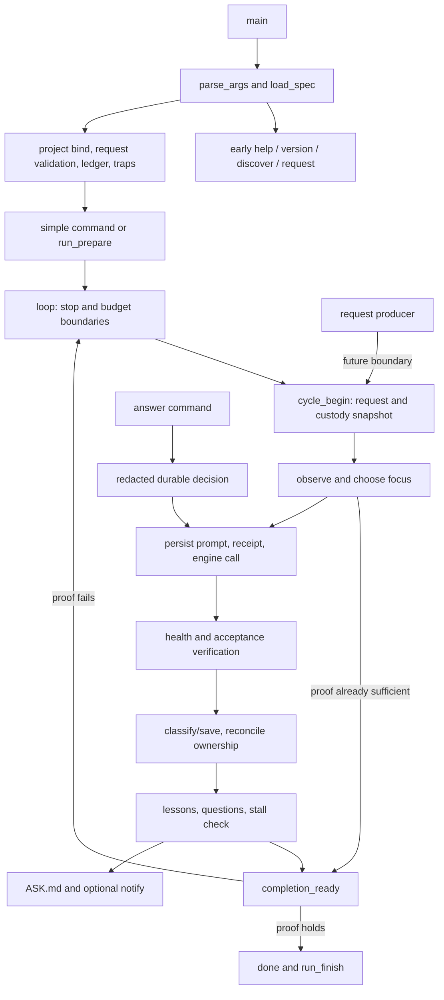

# LOOP, HUMAN and INTERFACE source review

Frozen source: `ralphie.sh`, SHA-256 `c21744b635e3b640aa6d65b6c36daa7dc0d8e1e90b7bf45fb09f8937055aa905`. Every line in **3162–5478** was reviewed. The inventory covers **84 definitions: 83 top-level and one nested function**. Names and exact ranges match the complete Bash AST in `source-index.json`; nested `request_archive_locked` has an independent identity.

This is source comprehension. No product, test or README edits, live engines, gate commands, notification hooks, update fetches, commits or pushes were performed by this review. `EXTRACTED` means directly present in source; `INFERRED` is a stated consequence of those source facts. External command behavior is not inferred.

## Lifecycle map



The shared completion predicate requires current nonempty green health checks, trusted inputs, no self-edit, no failed required save, no outstanding owned work requiring a save, no newly pending request, and any bound acceptance proof. Exit 0 also includes limits and requested stops; it is not an objective-completion signal by itself.

## Interface and protocol inventory

### Layer contracts and initialized globals

Source: [L3162](../ralphie.sh#L3162), [L3180](../ralphie.sh#L3180), [L3181](../ralphie.sh#L3181), [L3379](../ralphie.sh#L3379), [L3546](../ralphie.sh#L3546), [L3678](../ralphie.sh#L3678), [L4314](../ralphie.sh#L4314), [L4630](../ralphie.sh#L4630), [L5025](../ralphie.sh#L5025), [L5084](../ralphie.sh#L5084), [L5085](../ralphie.sh#L5085), [L5086](../ralphie.sh#L5086), [L5088](../ralphie.sh#L5088), [L5477](../ralphie.sh#L5477), [L5478](../ralphie.sh#L5478).

**behaviors.**
- Layer 5 supplies deterministic observation/focus, engine execution, independent verification, evidence/save classification and durable learning; layer 6 keeps human requests/questions as files; layer 7 orders CLI dispatch and run lifecycle.
- At source load: acceptance arguments/proofs are reset; FOCUS/FOCUS_KIND/OBJECTIVE_TEXT and REPORT_* start empty; RALPHIE_CONTRACT is literal text, not shell code.
- ALL_CAPS is autonomy gates memory subagents resume skills json stream usage.
- ENGINE starts empty; MODEL and THINKING come from their RALPHIE_* defaults; cycles/minutes unlimited (0); auto-commit and YOLO enabled; auto-update comes from environment; done-when-green disabled; objective/spec/gates empty; CMD=run; REST empty.
- Nonempty RALPHIE_ENGINE_CMD makes selection explicit even before parse_args. --engine may replace that selection.
- At entry: RALPHIE_LIB=1 calls project_bind only after defining functions and globals; otherwise main runs. Sourcing is therefore not a no-side-effect library operation: it changes shell options/globals in earlier layers and binds/exports the project.

### All 15 recognized command spellings

Source: [L5151](../ralphie.sh#L5151), [L5154](../ralphie.sh#L5154), [L5213](../ralphie.sh#L5213), [L5235](../ralphie.sh#L5235), [L5455](../ralphie.sh#L5455), [L5475](../ralphie.sh#L5475).

| Command | Arguments | Behavior | Sources |
| --- | --- | --- | --- |
| `run` | — | Default execution path; options must precede the command. parse_args captures trailing argv into REST, but run_prepare does not consume REST as objective/options. | [L5151](../ralphie.sh#L5151), [L5239](../ralphie.sh#L5239) |
| `discover` | no arguments | Early read-only orientation via cmd_discover before ledger/traps/update; rejects trailing args in layer 3. | [L5459](../ralphie.sh#L5459), [L1022](../ralphie.sh#L1022) |
| `status` | optional first --json | Human report by default; exact first --json selects machine output; other trailing args are not generally rejected. | [L5217](../ralphie.sh#L5217), [L4879](../ralphie.sh#L4879) |
| `doctor` | — | Capabilities/presence/liveness diagnostic; engine version probes may execute. | [L5231](../ralphie.sh#L5231), [L4982](../ralphie.sh#L4982) |
| `gates` | optional first --redetect | Discover/display; redetect backs up then removes old list+baseline and rediscovers while refusing live worker. | [L5230](../ralphie.sh#L5230), [L5036](../ralphie.sh#L5036) |
| `ask` | — | Show bounded open-question excerpts or no-open-questions. | [L5221](../ralphie.sh#L5221), [L4544](../ralphie.sh#L4544) |
| `answer` | N, answer argv joined with one space between arguments | Rewrite numbered ASK section and remember a redacted one-line operator decision. | [L5223](../ralphie.sh#L5223), [L4586](../ralphie.sh#L4586) |
| `request` | TEXT, --file FILE, list, archive | Early dedicated path before ledger/traps. No args/list enumerate, archive retains batch, other accepted forms publish. | [L5461](../ralphie.sh#L5461), [L4458](../ralphie.sh#L4458) |
| `memory` | — | Show MEMORY.md if nonempty, otherwise nothing-learned commentary. | [L5220](../ralphie.sh#L5220), [L5213](../ralphie.sh#L5213) |
| `forget` | — | Explicitly disable acceptance and remove stored objective/hash when nonempty. | [L5218](../ralphie.sh#L5218), [L4970](../ralphie.sh#L4970) |
| `log` | optional first n, default 20 | Tail current ledger; nondigit n falls back to 20; render only matching event lines. | [L5219](../ralphie.sh#L5219), [L5074](../ralphie.sh#L5074) |
| `stop` | — | Touch stop file; loop consumes it between cycles and ignores a stale first-iteration request. | [L5228](../ralphie.sh#L5228), [L4288](../ralphie.sh#L4288) |
| `update` | — | Run self_update; explicit result is propagated by run_simple_command. | [L5229](../ralphie.sh#L5229), [L4826](../ralphie.sh#L4826) |
| `version` | — | Print ralphie followed by version; handled before project bind/ledger. | [L5215](../ralphie.sh#L5215), [L5456](../ralphie.sh#L5456) |
| `help` | — | Print help; handled before project bind/ledger. | [L5216](../ralphie.sh#L5216), [L5456](../ralphie.sh#L5456) |

- There are no separate command aliases. -h/--help and --version are immediate global options, not subcommand aliases.
- Except discover/request/spec validation and answer number lookup, unused trailing command arguments are not uniformly rejected.
- The layer header says ten commands; the parse_args case actually recognizes fifteen.

### All 22 option families and positional parsing

Source: [L5084](../ralphie.sh#L5084), [L5088](../ralphie.sh#L5088), [L5090](../ralphie.sh#L5090), [L5096](../ralphie.sh#L5096), [L5122](../ralphie.sh#L5122), [L5145](../ralphie.sh#L5145), [L5202](../ralphie.sh#L5202).

| Spelling | Value/default | Validation and effect | Source |
| --- | --- | --- | --- |
| `--project` | DIR; RALPHIE_PROJECT or script directory | existing directory; need nonempty value. PROJECT override; physical absolute binding after parse | [L5155](../ralphie.sh#L5155) |
| `-o / --objective` | TEXT; empty/resume stored file | nonempty argument. replace objective; last explicit objective assignment wins | [L5156](../ralphie.sh#L5156) |
| `--spec` | FILE; none | once; readable regular file; run only; no objective or REST; plain text 1..1048576 bytes. read once from invocation cwd before binding | [L5157](../ralphie.sh#L5157) |
| `--engine` | NAME; Prime preferred then layer-4 selection | nonempty argument; adapter validates selection. ENGINE_EXPLICIT=1; no provider substitution | [L5160](../ralphie.sh#L5160) |
| `-b / --branch` | NAME; RALPHIE_BRANCH or empty | nonempty argument. requested work branch | [L5161](../ralphie.sh#L5161) |
| `--model` | ID; RALPHIE_MODEL or empty | nonempty argument. engine model identifier | [L5162](../ralphie.sh#L5162) |
| `--thinking` | LEVEL; RALPHIE_THINKING or empty | nonempty argument; parser does not enforce help enum. pass level through adapter; help lists off\|minimal\|low\|medium\|high\|xhigh\|max | [L5163](../ralphie.sh#L5163) |
| `-n / --cycles` | N; 0 unlimited | digits only via is_int; no sign. maximum cycles per invocation; 0 disables | [L5164](../ralphie.sh#L5164) |
| `-m / --minutes` | N; 0 unlimited | digits only via is_int; no sign. engine/observe allowance, not hard completion deadline | [L5165](../ralphie.sh#L5165) |
| `--once` | flag; off | none. MAX_CYCLES=1 | [L5166](../ralphie.sh#L5166) |
| `--gate` | CMD; no extra commands | repeatable; nonempty argument; literal LF forbidden; CR not expressly forbidden. append trialled unique command to persistent gates | [L5167](../ralphie.sh#L5167) |
| `--accept` | CMD; persisted binding or absent | once; nonempty/nonblank; LF and CR forbidden. separate completion condition with exact objective identity | [L5179](../ralphie.sh#L5179) |
| `--no-commit` | flag; AUTO_COMMIT=1 | none. waive automatic saving and allow verified completion on disk | [L5184](../ralphie.sh#L5184) |
| `--no-update` | flag; DO_UPDATE from RALPHIE_AUTO_UPDATE | none. set DO_UPDATE=0 for automatic update; global RALPHIE_NO_UPDATE remains stronger | [L5185](../ralphie.sh#L5185) |
| `--update` | flag; DO_UPDATE from RALPHIE_AUTO_UPDATE | none. set DO_UPDATE=1; auto-update failure does not abort run | [L5186](../ralphie.sh#L5186) |
| `--done-when-green` | flag; off | none. enable health/no-outstanding-work completion triggers, still subject to completion_ready | [L5187](../ralphie.sh#L5187) |
| `--no-yolo` | flag; YOLO=1 | none. withhold adapter bypass flags where supported; not a general sandbox | [L5188](../ralphie.sh#L5188) |
| `-v / --verbose` | flag; RALPHIE_VERBOSE or 0 | none. VERBOSE=1; QUIET=0; last opposite flag wins | [L5192](../ralphie.sh#L5192) |
| `-q / --quiet` | flag; RALPHIE_QUIET or 0 | none. QUIET=1; VERBOSE=0; warnings/errors/verdicts survive | [L5193](../ralphie.sh#L5193) |
| `-h / --help` | flag; none | none. immediate usage and exit 0 even before load_spec | [L5194](../ralphie.sh#L5194) |
| `--version` | flag; none | none. immediate bare VERSION and exit 0 | [L5195](../ralphie.sh#L5195) |
| `--` | remaining argv; none | no subsequent option parsing. join remaining argv with spaces as explicit objective | [L5196](../ralphie.sh#L5196) |

- Only separated option values are recognized; --name=value, clustered short options, or --no-* inverses beyond listed spellings are not implemented.
- Scanning stops at the first recognized command. All remaining argv elements go into REST unchanged and are not parsed as global options.
- Scanning also stops at the first ordinary token or --; all remaining arguments become OBJECTIVE via "$*", joining distinct arguments with spaces.
- One bare lowercase/hyphen word that prefixes or extends a known typo-list command is rejected; multiword objectives bypass this heuristic; discover is not in that list.
- need_value checks count and nonempty value only, so another flag spelling can be consumed as an option value.
- load_spec checks conflicts after parsing, before project binding and generic persistent setup. Positional file paths are text unless supplied with --spec.
- Physical --project/RALPHIE_PROJECT binding resolves relative paths from invocation cwd. --spec is also invocation-cwd relative; request --file is project-root relative.

### Public environment and standard-shell context

Source: [L4711](../ralphie.sh#L4711), [L4774](../ralphie.sh#L4774), [L5084](../ralphie.sh#L5084), [L5088](../ralphie.sh#L5088), [L4618](../ralphie.sh#L4618), [L4625](../ralphie.sh#L4625), [L4831](../ralphie.sh#L4831), [L4854](../ralphie.sh#L4854), [L5477](../ralphie.sh#L5477).

| Variable | Default | Meaning | Evidence |
| --- | --- | --- | --- |
| `RALPHIE_ENGINE_CMD` | empty | Custom command that reads stdin; nonempty marks explicit selection. | [L2539](../ralphie.sh#L2539), [L2546](../ralphie.sh#L2546), [L2624](../ralphie.sh#L2624), [L2625](../ralphie.sh#L2625), [L2737](../ralphie.sh#L2737), [L2738](../ralphie.sh#L2738), [L2741](../ralphie.sh#L2741), [L5088](../ralphie.sh#L5088) |
| `RALPHIE_ENGINE_CAPS` | empty | Declared capabilities of custom command; help lists autonomy gates memory subagents resume skills json. | [L2548](../ralphie.sh#L2548) |
| `RALPHIE_ENGINE_ANSWER` | stdout | Custom answer routing stdout or file via RALPHIE_OUTPUT. | [L2547](../ralphie.sh#L2547) |
| `RALPHIE_NOTIFY_CMD` | empty/disabled | Shell command for notifications with RALPHIE_MESSAGE. | [L4618](../ralphie.sh#L4618), [L4622](../ralphie.sh#L4622) |
| `RALPHIE_NOTIFY_WAIT` | 10 seconds | How long notify polls before leaving still-running hook. | [L4624](../ralphie.sh#L4624) |
| `RALPHIE_MIN_UPDATE_BYTES` | 40000 | Minimum candidate download bytes accepted for update. | [L4851](../ralphie.sh#L4851) |
| `NO_COLOR` | unset/empty | Nonempty disables color; implementation also requires tty and nondumb TERM. | [L122](../ralphie.sh#L122) |
| `ENGINE_TIMEOUT` | 2400 seconds | Per-engine call allowance, capped by remaining run budget. | [L2693](../ralphie.sh#L2693), [L2887](../ralphie.sh#L2887) |
| `ENGINE_IDLE_TIMEOUT` | 600 seconds | Idle allowance for streaming engines only. | [L2905](../ralphie.sh#L2905) |
| `ENGINE_OUTPUT_MAX_BYTES` | 16777216 bytes | Captured output ceiling; positive number, invalid/zero use default; polling may overshoot. | [L2858](../ralphie.sh#L2858) |
| `GATE_TIMEOUT` | 900 seconds | Per health/acceptance gate allowance. | [L1362](../ralphie.sh#L1362), [L1684](../ralphie.sh#L1684), [L2710](../ralphie.sh#L2710), [L3279](../ralphie.sh#L3279) |
| `COMMIT_TIMEOUT` | 120 seconds | Commit including hooks/signing allowance. | [L2458](../ralphie.sh#L2458) |
| `GATE_RETRIES` | 1 | Confirm a failed gate this many times; 0 trusts first result. | [L1370](../ralphie.sh#L1370) |
| `RALPHIE_KEEP_CYCLES` | 50 | Cycle prompt/output retention count. | [L592](../ralphie.sh#L592) |
| `RALPHIE_KEEP_RUNS` | 5 | Engine session directory retention count. | [L642](../ralphie.sh#L642) |
| `RALPHIE_LEDGER_MAX` | 16777216 bytes (help: 16 MB) | Ledger rotation threshold. | [L619](../ralphie.sh#L619) |
| `RALPHIE_LEDGER_GENERATIONS` | 5 | Retained rotated ledgers. | [L629](../ralphie.sh#L629) |
| `ENGINE_RETRIES` | 3 | Attempts before provider fallback when permitted. | [L2801](../ralphie.sh#L2801) |
| `ENGINE_BACKOFF` | 5 seconds | Linear retry backoff increment. | [L2846](../ralphie.sh#L2846) |
| `ENGINE_MAX_TURNS` | 24 | Native autonomous turn setting. | [L2705](../ralphie.sh#L2705) |
| `ENGINE_MAX_CONT` | 6 | Native autonomous continuation setting. | [L2706](../ralphie.sh#L2706) |
| `ENGINE_MAX_TOKENS` | unset; engine default | Optional native autonomous token cap. | [L2715](../ralphie.sh#L2715) |
| `GATE_TRIAL_TIMEOUT` | 120 seconds | Candidate-gate trial allowance. | [L1225](../ralphie.sh#L1225) |
| `GATE_BRIEF_BYTES` | 3000 | Failure excerpt offered to engine. | [L1692](../ralphie.sh#L1692) |
| `GATE_LOG_MAX` | 262144 bytes | Retained gate/acceptance log tail size. | [L1401](../ralphie.sh#L1401), [L3281](../ralphie.sh#L3281) |
| `NOCHANGE_LIMIT` | 3 cycles | Consecutive nonprogress threshold before exit 3. | [L4222](../ralphie.sh#L4222) |
| `MEMORY_MAX` | 60 lessons | Newest durable lessons retained. | [L3725](../ralphie.sh#L3725), [L3727](../ralphie.sh#L3727) |
| `MIN_ANSWER_BYTES` | 2 | Minimum engine answer length. | [L2781](../ralphie.sh#L2781) |
| `RALPHIE_MAX_COMMIT_BYTES` | 1048576 bytes | Automatic commit file size ceiling. | [L2077](../ralphie.sh#L2077), [L2254](../ralphie.sh#L2254) |
| `RALPHIE_ENGINE_SESSION` | 1/enabled | 0 prevents per-run Prime session persistence. | [L2688](../ralphie.sh#L2688) |
| `RALPHIE_GIT_INIT` | 1/enabled | 0 refuses creating Git for a nonrepository project. | [L1706](../ralphie.sh#L1706) |
| `RALPHIE_BRANCH` | empty | Default --branch. | [L5086](../ralphie.sh#L5086) |
| `RALPHIE_MODEL` | empty | Default --model. | [L5084](../ralphie.sh#L5084) |
| `RALPHIE_THINKING` | empty | Default --thinking. | [L5084](../ralphie.sh#L5084) |
| `RALPHIE_VERBOSE` | 0 | Initial verbosity. | [L129](../ralphie.sh#L129) |
| `RALPHIE_QUIET` | 0 | Initial quiet flag. | [L134](../ralphie.sh#L134) |
| `RALPHIE_AUTO_UPDATE` | 0 | Initial DO_UPDATE. | [L5085](../ralphie.sh#L5085) |
| `RALPHIE_NO_UPDATE` | 0 | Disable explicit and automatic self-update when true. | [L71](../ralphie.sh#L71), [L4831](../ralphie.sh#L4831), [L4832](../ralphie.sh#L4832), [L5470](../ralphie.sh#L5470) |
| `RALPHIE_UPDATE_URL` | derived GitHub raw URL | Explicit candidate source. | [L4805](../ralphie.sh#L4805) |
| `RALPHIE_PROJECT` | physical script directory | Initial project selector; overridden by --project; rebound/exported canonical path. | [L100](../ralphie.sh#L100), [L108](../ralphie.sh#L108) |
| `RALPHIE_LIB` | 0 | 1 suppresses main and binds project after source definitions. | [L49](../ralphie.sh#L49), [L4854](../ralphie.sh#L4854), [L5477](../ralphie.sh#L5477) |
| `RALPHIE_MESSAGE` | set per notification call | Output environment to notification sh -c; message treated as data. | [L4622](../ralphie.sh#L4622), [L4719](../ralphie.sh#L4719) |
| `RALPHIE_ANSWER` | set per answer rewrite | Output environment to awk; prevents -v escape decoding. | [L4597](../ralphie.sh#L4597) |
| `RALPHIE_OUTPUT` | engine adapter supplies path | Custom file-answer engine output path, mentioned in help; consumed by layer 4. | [L4723](../ralphie.sh#L4723) |
| `TERM` | dumb when unset | Standard terminal context; colors require nondumb value and tty. | [L122](../ralphie.sh#L122) |
| `BASH_VERSION` | unknown if unset in doctor | Standard shell diagnostic field; not an engine option. | [L4989](../ralphie.sh#L4989) |

- Numeric defaults listed by help are not all validated by the interface layer; validation lives at each consuming function.
- Internal CY_*, ACCEPT_*, ownership, gate and cache variables are shared shell state rather than supported environment configuration. Literal fallback sites are inventoried separately.

### All literal uppercase parameter fallback sites in assigned implementation

Source: [L3180](../ralphie.sh#L3180), [L5084](../ralphie.sh#L5084), [L5086](../ralphie.sh#L5086).

- Includes internal state safety defaults as well as environment options; presence in this list does not make an internal variable a supported operator setting.
- Exact source expressions are retained instead of flattening nested Bash expansions into guessed values.

All assigned implementation fallback sites, including internal shared-state defaults:

- [L3198](../ralphie.sh#L3198): `if [ -n "${OBJECTIVE:-}" ]; then printf '%s' "$OBJECTIVE" | sha_of`
- [L3222](../ralphie.sh#L3222): `local previous="${ACCEPT_OLD_OBJECTIVE:-}"`
- [L3226](../ralphie.sh#L3226): `if [ -n "${OBJECTIVE:-}" ] && [ "$obj" != "$previous" ]; then reset=1; fi`
- [L3274](../ralphie.sh#L3274): `[ "$GATES_GREEN" = yes ] && [ "${GATES_NONE:-0}" != 1 ] &&`
- [L3279](../ralphie.sh#L3279): `gate_exec "$ACCEPT_CMD" "$out" "${GATE_TIMEOUT:-900}" || rc=$?`
- [L3281](../ralphie.sh#L3281): `local lmax="${GATE_LOG_MAX:-262144}"`
- [L3300](../ralphie.sh#L3300): `if [ "${ACCEPT_CHANGED:-0}" = 1 ] && [ "$CY_MAY_COMMIT" = 1 ] &&`
- [L3301](../ralphie.sh#L3301): `[ "${CY_SELF_EDIT:-0}" != 1 ] &&`
- [L3302](../ralphie.sh#L3302): `{ [ "${COMMIT_FAILED:-0}" != 1 ] || [ "$(commit_head)" = "${CY_HEAD:-none}" ]; } && acceptance_intact; then`
- [L3354](../ralphie.sh#L3354): `[ "$GATES_GREEN" = yes ] && [ "${GATES_NONE:-0}" != 1 ] &&`
- [L3355](../ralphie.sh#L3355): `[ "$CY_MAY_COMMIT" = 1 ] && [ "${COMMIT_FAILED:-0}" != 1 ] &&`
- [L3363](../ralphie.sh#L3363): `is_true "${AUTO_COMMIT:-1}" && [ "${GIT_MODE:-repo}" = repo ] &&`
- [L3364](../ralphie.sh#L3364): `[ -s "${OWNED_FILE:-$HOME_DIR/owned.nul}" ]`
- [L3371](../ralphie.sh#L3371): `[ "${GATES_GREEN:-no}" = yes ] && [ "${GATES_NONE:-0}" != 1 ] &&`
- [L3372](../ralphie.sh#L3372): `[ "${CY_MAY_COMMIT:-1}" = 1 ] && [ "${CY_GATE_TAMPER:-0}" != 1 ] &&`
- [L3373](../ralphie.sh#L3373): `[ "${COMMIT_FAILED:-0}" != 1 ] &&`
- [L3374](../ralphie.sh#L3374): `[ "${CY_SELF_EDIT:-0}" != 1 ] && ! unsaved_work &&`
- [L3385](../ralphie.sh#L3385): `[ -n "${OBJECTIVE_MEM:-}" ] || return 0`
- [L3409](../ralphie.sh#L3409): `if [ "${GATES_GREEN:-unknown}" = "no" ]; then`
- [L3411](../ralphie.sh#L3411): `if [ -n "${GATE_TIMED_OUT:-}" ]; then`
- [L3435](../ralphie.sh#L3435): `if [ "${GATES_NONE:-0}" = "1" ]; then`
- [L3612](../ralphie.sh#L3612): `printf '\nLast run: %s\n' "$([ "${GATES_GREEN:-unknown}" = "yes" ] && printf 'all passing' || printf 'FAILING')"`
- [L3613](../ralphie.sh#L3613): `if [ "${GATES_GREEN:-unknown}" = "no" ]; then`
- [L3725](../ralphie.sh#L3725): `if [ "$n" -gt "${MEMORY_MAX:-60}" ]; then`
- [L3727](../ralphie.sh#L3727): `{ printf '# Durable lessons\n\n'; grep '^- ' "$MEMORY_FILE" | tail -n "${MEMORY_MAX:-60}"; } > "$tmp"`
- [L3832](../ralphie.sh#L3832): `if [ -n "${LAST_VERIFY_FP:-}" ] && [ "$LAST_VERIFY_FP" = "$CY_FP" ] && ! verify_mark_stale; then`
- [L3833](../ralphie.sh#L3833): `GATES_GREEN="$LAST_VERIFY_RESULT"; GATES_NONE="${LAST_VERIFY_NONE:-0}"`
- [L3837](../ralphie.sh#L3837): `gate_summary="${LAST_VERIFY_SUMMARY:-}"`
- [L3849](../ralphie.sh#L3849): `if   [ "${GATES_NONE:-0}" = "1" ]; then warn "gates: none - nothing here can be verified"`
- [L3864](../ralphie.sh#L3864): `if [ -z "$ACCEPT_BIND" ] && is_true "${DONE_WHEN_GREEN:-0}" && completion_ready \`
- [L3865](../ralphie.sh#L3865): `&& { [ -z "${REQUEST_CYCLE_IDS:-}" ] || [ "$(state_get objective_started '')" = "$(state_get objective_hash '')" ]; } \`
- [L3907](../ralphie.sh#L3907): `remember "Gates must not be removed. '${CY_TAMPER_NAME:-a gate}' was deleted during a cycle and was restored automatically."`
- [L3908](../ralphie.sh#L3908): `ask_human "The engine removed the gate '${CY_TAMPER_NAME:-a gate}' during the final cycle of a timed run. Ralphie restored it. Review that cycle before trusting it."`
- [L3924](../ralphie.sh#L3924): `[ -n "${CYCLE_ENGINE:-}" ] && [ "$CYCLE_ENGINE" != "$ENGINE" ] && \`
- [L3953](../ralphie.sh#L3953): `[ "$actual_work" = "${ACCEPT_BEFORE:-}" ] || ACCEPT_CHANGED=1`
- [L3997](../ralphie.sh#L3997): `remember "Gates must not be removed. '${CY_TAMPER_NAME:-a gate}' was deleted during a cycle and was restored automatically."`
- [L3998](../ralphie.sh#L3998): `ask_human "A command removed the gate '${CY_TAMPER_NAME:-a gate}' during a cycle. Ralphie restored it. Review that cycle before trusting it."`
- [L4030](../ralphie.sh#L4030): `if [ "$GATES_GREEN" = yes ] && [ "${GATES_NONE:-0}" != 1 ] &&`
- [L4031](../ralphie.sh#L4031): `[ "$CY_MAY_COMMIT" = 1 ] && [ "${COMMIT_FAILED:-0}" != 1 ] && [ "$CY_SELF_EDIT" != 1 ]; then`
- [L4046](../ralphie.sh#L4046): `event cycle nochange "${REPORT_SUMMARY:-engine made no change}"`
- [L4050](../ralphie.sh#L4050): `NOCHANGE_STREAK=$(( ${NOCHANGE_STREAK:-0} + 1 ))`
- [L4069](../ralphie.sh#L4069): `NOCHANGE_STREAK=$(( ${NOCHANGE_STREAK:-0} + 1 ))`
- [L4090](../ralphie.sh#L4090): `if [ -n "${REPORT_SUMMARY:-}" ]; then`
- [L4093](../ralphie.sh#L4093): `if [ -n "${GATE_FAIL_CMD:-}" ]`
- [L4104](../ralphie.sh#L4104): `[ "${GATES_NONE:-0}" = "1" ] || good "gates: green"`
- [L4114](../ralphie.sh#L4114): `head_before="${CY_HEAD:-$(commit_head)}"`
- [L4125](../ralphie.sh#L4125): `is_true "${AUTO_COMMIT:-1}" && { git_commit_cycle "$(commit_message "$CY_N")" || true; }`
- [L4130](../ralphie.sh#L4130): `is_true "${AUTO_COMMIT:-1}" && { git_commit_cycle "$(commit_message "$CY_N")" || true; }`
- [L4148](../ralphie.sh#L4148): `if is_true "${AUTO_COMMIT:-1}" && [ "${COMMIT_SKIPPED:-0}" != "1" ] \`
- [L4149](../ralphie.sh#L4149): `&& [ "${COMMIT_FAILED:-0}" != "1" ] && [ "$head_after" = "$head_before" ]; then`
- [L4157](../ralphie.sh#L4157): `if [ "${COMMIT_FAILED:-0}" = "1" ]; then`
- [L4160](../ralphie.sh#L4160): `NOCHANGE_STREAK=$(( ${NOCHANGE_STREAK:-0} + 1 ))`
- [L4166](../ralphie.sh#L4166): `event cycle blocked "${COMMIT_BLOCKED_WHY:-git refused the commit}"`
- [L4167](../ralphie.sh#L4167): `elif [ "${GATES_NONE:-0}" = "1" ]; then`
- [L4176](../ralphie.sh#L4176): `event cycle unverified "${REPORT_SUMMARY:-work completed, nothing checked it}"`
- [L4180](../ralphie.sh#L4180): `event cycle pass "${REPORT_SUMMARY:-work completed}"`
- [L4195](../ralphie.sh#L4195): `LAST_VERIFY_NONE="${GATES_NONE:-0}"`
- [L4205](../ralphie.sh#L4205): `if [ -n "${GATE_TIMED_OUT:-}" ]; then`
- [L4206](../ralphie.sh#L4206): `warn "gate '$GATE_TIMED_OUT' timed out after ${GATE_TIMED_OUT_SECS:-?}s - raise GATE_TIMEOUT if it needs longer"`
- [L4207](../ralphie.sh#L4207): `ask_human "The gate '$GATE_TIMED_OUT' was killed after ${GATE_TIMED_OUT_SECS:-?}s. If it legitimately takes longer, run with a larger GATE_TIMEOUT; otherwise it is genuinely hanging."`
- [L4209](../ralphie.sh#L4209): `if [ -n "${GATE_FLAKY:-}" ]; then`
- [L4222](../ralphie.sh#L4222): `if [ "${NOCHANGE_STREAK:-0}" -ge "${NOCHANGE_LIMIT:-3}" ]; then`
- [L4232](../ralphie.sh#L4232): `{ [ -n "$ACCEPT_BIND" ] && is_true "${DONE_WHEN_GREEN:-0}" && [ -z "$(backlog_items | head -1)" ]; }; } &&`
- [L4236](../ralphie.sh#L4236): `event cycle done "${REPORT_SUMMARY:-objective met, gates green}"`
- [L4243](../ralphie.sh#L4243): `[ "$REPORT_STATUS" = "blocked" ] && event engine stuck "${REPORT_ASK:-engine reported blocked}"`
- [L4251](../ralphie.sh#L4251): `local n="$1" s="${REPORT_SUMMARY:-autonomous cycle}" verdict`
- [L4253](../ralphie.sh#L4253): `if [ "${GATES_NONE:-0}" = "1" ]; then`
- [L4260](../ralphie.sh#L4260): `local obj; obj="${OBJECTIVE_TEXT:-$FOCUS}"`
- [L4263](../ralphie.sh#L4263): `"${CYCLE_ENGINE:-${ENGINE:-unknown}}" \`
- [L4264](../ralphie.sh#L4264): `"$([ "${CYCLE_ENGINE:-$ENGINE}" = "${ENGINE:-}" ] && printf '%s' "${MODEL:-default}" || printf 'default')" \`
- [L4281](../ralphie.sh#L4281): `if [ "${RUN_DEADLINE:-0}" -le 0 ] && [ "${MAX_MINUTES:-0}" -gt 0 ]; then`
- [L4299](../ralphie.sh#L4299): `if [ "${MAX_CYCLES:-0}" -gt 0 ] && [ "$i" -gt "${MAX_CYCLES}" ]; then`
- [L4357](../ralphie.sh#L4357): `REQUEST_IDS="$REQUEST_IDS${REQUEST_IDS:+$RALPHIE_NL}$f"`
- [L4364](../ralphie.sh#L4364): `local saved="${REQUEST_CYCLE_IDS:-}" f`
- [L4390](../ralphie.sh#L4390): `[ -n "${REQUEST_CYCLE_IDS:-}" ] || return 0`
- [L4406](../ralphie.sh#L4406): `[ -n "${REQUEST_CYCLE_IDS:-}" ] || return 0`
- [L4618](../ralphie.sh#L4618): `[ -n "${RALPHIE_NOTIFY_CMD:-}" ] || return 0`
- [L4624](../ralphie.sh#L4624): `while [ "$i" -lt "${RALPHIE_NOTIFY_WAIT:-10}" ] && kill -0 "$p" 2>/dev/null; do sleep 1; i=$((i+1)); done`
- [L4805](../ralphie.sh#L4805): `[ -n "${RALPHIE_UPDATE_URL:-}" ] && { printf '%s' "$RALPHIE_UPDATE_URL"; return 0; }`
- [L4831](../ralphie.sh#L4831): `if is_true "${RALPHIE_NO_UPDATE:-0}"; then`
- [L4851](../ralphie.sh#L4851): `[ "$sz" -ge "${RALPHIE_MIN_UPDATE_BYTES:-40000}" ] || { rm -f "$tmp"; warn "downloaded file is implausibly small (${sz} bytes)"; return 1; }`
- [L4989](../ralphie.sh#L4989): `printf '  bash      %s\n' "${BASH_VERSION:-unknown}"`
- [L5053](../ralphie.sh#L5053): `[ -n "${GATES_BASELINE_FILE:-}" ] || GATES_BASELINE_FILE="$HOME_DIR/gates.baseline"`
- [L5084](../ralphie.sh#L5084): `ENGINE=""; MODEL="${RALPHIE_MODEL:-}"; THINKING="${RALPHIE_THINKING:-}"`
- [L5085](../ralphie.sh#L5085): `MAX_CYCLES=0; MAX_MINUTES=0; AUTO_COMMIT=1; DO_UPDATE="${RALPHIE_AUTO_UPDATE:-0}"`
- [L5086](../ralphie.sh#L5086): `DONE_WHEN_GREEN=0; OBJECTIVE=""; SPEC_FILE=""; OBJECTIVE_EXPLICIT=0; EXTRA_GATES=""; CMD="run"; YOLO=1; ENGINE_EXPLICIT=0; BRANCH="${RALPHIE_BRANCH:-}"; REST=()`
- [L5088](../ralphie.sh#L5088): `[ -n "${RALPHIE_ENGINE_CMD:-}" ] && ENGINE_EXPLICIT=1`
- [L5246](../ralphie.sh#L5246): `[ "${MAX_MINUTES:-0}" -gt 0 ] && RUN_DEADLINE=$(( $(now_epoch) + MAX_MINUTES * 60 ))`
- [L5296](../ralphie.sh#L5296): `if [ "${GATE_NO_PIPEFAIL:-0}" = "1" ]; then`
- [L5425](../ralphie.sh#L5425): `[ -n "${RESTORE_BRANCH:-}" ] && git_ready || return 0`
- [L5470](../ralphie.sh#L5470): `if is_true "$DO_UPDATE" && ! is_true "${RALPHIE_NO_UPDATE:-0}"; then self_update || true; fi`
- [L5477](../ralphie.sh#L5477): `if [ "${RALPHIE_LIB:-0}" = "1" ]; then project_bind "$PROJECT"`

### Project-local persistence and evidence paths

Source: [L106](../ralphie.sh#L106), [L120](../ralphie.sh#L120), [L3217](../ralphie.sh#L3217), [L4328](../ralphie.sh#L4328), [L4875](../ralphie.sh#L4875).

Canonical PROJECT/.ralphie; set by project_bind outside assigned range.

| Path under .ralphie | Protocol | Sources |
| --- | --- | --- |
| `state` | Key=value derived state plus durable binding/work identities. Counts can rebuild elsewhere; exact acceptance identities cannot be inferred from ordinary counters. | [L3184](../ralphie.sh#L3184), [L3190](../ralphie.sh#L3190), [L3199](../ralphie.sh#L3199), [L3265](../ralphie.sh#L3265), [L4373](../ralphie.sh#L4373), [L5084](../ralphie.sh#L5084) |
| `events.jsonl` | Append-only event records; consumers here read the current generation only. Event schema ts/run/cycle/kind/status/detail plus string extras is defined at 351–381. | [L3507](../ralphie.sh#L3507), [L3770](../ralphie.sh#L3770), [L4273](../ralphie.sh#L4273) |
| `OBJECTIVE.md` | Authoritative objective bytes captured in OBJECTIVE_MEM. Explicit spec bytes are exact; normal text gets a presentation newline; per-cycle guard restores changes. | [L3384](../ralphie.sh#L3384), [L3407](../ralphie.sh#L3407), [L3586](../ralphie.sh#L3586), [L5319](../ralphie.sh#L5319), [L5335](../ralphie.sh#L5335) |
| `acceptance` | Four-line file: ralphie-acceptance-v1, random nonce, exact objective identity, single-line command. Digest stored in state and memory; absent requirement uses empty or none binding. | [L3210](../ralphie.sh#L3210), [L3236](../ralphie.sh#L3236), [L3253](../ralphie.sh#L3253), [L3257](../ralphie.sh#L3257) |
| `gates` | One shell command per accepted line, with layer-3 filtering. Persistent agreed set; additions allowed; removal requires explicit stopped-worker redetection. | [L3607](../ralphie.sh#L3607), [L5036](../ralphie.sh#L5036), [L5362](../ralphie.sh#L5362) |
| `gates.baseline` | Persistent agreed gate witness; restored at run preparation and cycle boundaries; saved only after nontampered verification. | [L4006](../ralphie.sh#L4006), [L5053](../ralphie.sh#L5053), [L5061](../ralphie.sh#L5061), [L5294](../ralphie.sh#L5294) |
| `gates.previous` | Best-effort backup of nonempty gate file before redetection. | [L5058](../ralphie.sh#L5058) |
| `MEMORY.md` | Header plus - lesson lines; flatten/dedup/cap each line; retain MEMORY_MAX; recent 3900-byte excerpt enters prompts. | [L3451](../ralphie.sh#L3451), [L3710](../ralphie.sh#L3710), [L4606](../ralphie.sh#L4606), [L5220](../ralphie.sh#L5220) |
| `ASK.md` | Question headers and text with blank > answer slots; CLI answer rewrites header to answered and fills blank slots; open excerpts omit > lines. | [L4525](../ralphie.sh#L4525), [L4529](../ralphie.sh#L4529), [L4544](../ralphie.sh#L4544), [L4586](../ralphie.sh#L4586) |
| `requests/slot-N/ID.txt` | N in 1..32 reservation slots; ID epoch-pid-random token; published body chmod 400 after bounded text validation. | [L4347](../ralphie.sh#L4347), [L4489](../ralphie.sh#L4489), [L4494](../ralphie.sh#L4494), [L4507](../ralphie.sh#L4507), [L4508](../ralphie.sh#L4508) |
| `requests/slot-N/.body` | Exclusive private staging file; interrupted reservations are retained, never silently pruned. | [L4498](../ralphie.sh#L4498), [L4500](../ralphie.sh#L4500), [L4502](../ralphie.sh#L4502) |
| `requests/slot-N/ID.applied` | Exclusive mode-077 receipt containing the durable prompt path; indicates presentation, not implementation or acceptance. | [L4408](../ralphie.sh#L4408), [L4411](../ralphie.sh#L4411) |
| `request-write.lock` | Short producer/archive lock independent of worker lock; pid-based common lock protocol. | [L4421](../ralphie.sh#L4421), [L4439](../ralphie.sh#L4439), [L4486](../ralphie.sh#L4486) |
| `request-archives/EPOCH-PID-TOKEN/` | Retained full batch after one directory rename; active directory recreated afterward; not fed to future prompts until resubmitted. | [L4444](../ralphie.sh#L4444), [L4446](../ralphie.sh#L4446), [L4451](../ralphie.sh#L4451) |
| `lock/pid` | Worker lock owner used by run liveness, archive exclusion and redetection checks. | [L4424](../ralphie.sh#L4424), [L4945](../ralphie.sh#L4945), [L5039](../ralphie.sh#L5039) |
| `stop` | Operator stop marker; consumed between cycles; existing marker on first iteration treated as stale. | [L4288](../ralphie.sh#L4288), [L4289](../ralphie.sh#L4289), [L5228](../ralphie.sh#L5228) |
| `run/cycle-N.prompt.md` | Persisted full engine prompt and request receipt target; subject to configured cycle retention. | [L3784](../ralphie.sh#L3784), [L3880](../ralphie.sh#L3880), [L4408](../ralphie.sh#L4408) |
| `run/cycle-N.answer` | Captured engine answer; parse last complete report before retained tail trim. | [L3786](../ralphie.sh#L3786), [L3926](../ralphie.sh#L3926), [L3928](../ralphie.sh#L3928) |
| `log/cycle-N.log` | Captured engine log retained after use; bounded by engine layer policies. | [L3785](../ralphie.sh#L3785), [L3927](../ralphie.sh#L3927) |
| `log/acceptance-N.log` | Acceptance stdout/stderr and exit event evidence; retained tail GATE_LOG_MAX. | [L3277](../ralphie.sh#L3277), [L3281](../ralphie.sh#L3281) |
| `run/gates-N*.summary` | Observe/post-verify gate outcome summaries; prompt/cache excerpts limited to 400 bytes here. | [L3841](../ralphie.sh#L3841), [L3963](../ralphie.sh#L3963), [L4197](../ralphie.sh#L4197) |
| `run/acceptance-paths.PID` | Repaired owned scratch file carrying NUL-separated eligible work paths; temporary, not a second persistent work ledger. | [L3315](../ralphie.sh#L3315) |
| `run/tree.mark and run/verify.mark` | Cross-layer filesystem freshness witnesses for work detection and verification reuse. | [L3886](../ralphie.sh#L3886), [L3970](../ralphie.sh#L3970), [L3978](../ralphie.sh#L3978), [L4196](../ralphie.sh#L4196) |
| `owned.nul` | Cross-layer content-keyed ownership witness for required unsaved work; reconciled at boundaries. | [L3364](../ralphie.sh#L3364), [L4023](../ralphie.sh#L4023) |
| `ralphie.previous` | Best-effort prior script backup before self-update; not guaranteed if copy fails. | [L4865](../ralphie.sh#L4865) |

- Despite broad help wording that files are yours to edit, request paths have stricter regular-file/ownership/symlink invariants and acceptance files are digest-bound.
- Active request evidence is never auto-pruned; ordinary cycle artifacts and ledger generations are bounded elsewhere.
- No new mandatory runtime-support repository file is required by this layer; target project manifests/checks/engine remain external prerequisites.

### Keys read or written by the reviewed lifecycle

Source: [L3184](../ralphie.sh#L3184), [L3190](../ralphie.sh#L3190), [L3199](../ralphie.sh#L3199), [L3303](../ralphie.sh#L3303), [L3770](../ralphie.sh#L3770), [L4032](../ralphie.sh#L4032), [L4373](../ralphie.sh#L4373), [L4879](../ralphie.sh#L4879), [L4950](../ralphie.sh#L4950), [L5357](../ralphie.sh#L5357).

| State key | Meaning |
| --- | --- |
| `acceptance_binding` | Required config digest or none; explicit durable identity. |
| `acceptance_work` | Digest of binding for which eligible work was observed; survives refused unchanged-HEAD save. |
| `objective_hash` | Hash of exact explicit input; resume identity, independent of presentation newline. |
| `objective_started` | Objective identity with a trusted health-green nonempty verified cycle; cleared on untrusted/save failure/self-edit and new request boundary. |
| `request_set` | Digest of newline-delimited absolute active request file membership. |
| `nochange_streak` | Persisted across cycles and processes; increments nochange/untrusted/blocked save, resets changed red/pass/unverified or new boundary. |
| `cycle` | Lifetime cycle index, repaired from ledger if it appears lost. |
| `status` | new/running/paused/stopped/done/blocked/stalled/error lifecycle state, plus interrupted display derived from liveness. |
| `reason` | Persisted stop/failure reason; this layer sets it for acceptance capture failure, engine failure, stall or detached HEAD. |
| `pass_count` | Recorded health-green progress cycles satisfying save policy. |
| `fail_count` | Recorded changed red cycles (engine failure events may be rebuilt separately by ledger logic). |
| `blocked_count` | Health-green cycles whose work could not be safely saved. |
| `untrusted_count` | Recorded work cycles rejected for damaged verification custody. |
| `unverified_count` | Saved/policy-accepted work when no health gate exists. |
| `learned_count` | Current retained durable lesson count. |
| `last_cycle_at` | Epoch time after record phase. |
| `total_seconds` | Accumulated full record-phase cycle elapsed time. |
| `engine` | Preferred engine persisted by choose_engine. |
| `model` | Specified preferred model if nonempty; actual fallback model attribution handled separately. |
| `run_id` | Current run identity used in commit/status evidence. |
| `start_commit` | Recovery point printed as git reset --keep. |
| `tokens_spent` | Lifetime engine-reported token count from engine layer. |
| `run_tokens` | Current run engine-reported token count. |
| `run_cost` | Current run engine-reported cost. |

### Engine final report

Source: [L3546](../ralphie.sh#L3546), [L3571](../ralphie.sh#L3571), [L3580](../ralphie.sh#L3580), [L3678](../ralphie.sh#L3678), [L3708](../ralphie.sh#L3708).

```text
<<<RALPHIE
status: progress | done | blocked
summary: one line describing what actually changed
lesson: one durable fact or -
ask: a specific human question or -
RALPHIE>>>
```

- Delimiter recognition is regex substring matching, not full-line anchors. A new opening marker resets the current candidate; each closing marker saves a complete candidate; the last complete block wins.
- A later incomplete candidate does not erase an earlier complete block. Text after the last complete block does not invalidate that block.
- Field labels status:, summary:, lesson:, ask: are case-sensitive, accept leading whitespace, take first matching line only, and strip CR.
- Status value is lowercased: done|complete|finished => done; blocked|stuck => blocked; every other value => progress. Trailing value whitespace is not explicitly trimmed.
- Exact lesson/ask values -, none, n/a, NA or empty suppress the field; other casing is retained.
- Missing answer file leaves all fields empty; present answer without a complete block defaults to progress.
- Summary is an attributed engine statement; it becomes display/ledger/commit text but is not a gate verdict. Lesson is flattened/deduplicated; ask is prefixed The engine asks: before human relay.

Report status can request completion, but completion_ready and real nonempty health gates authorize it. The text contract asks for one final block; parser deliberately tolerates malformed/no block.

### Immutable publication and cycle-boundary request consumption

Source: [L4328](../ralphie.sh#L4328), [L4510](../ralphie.sh#L4510).

**steps.**
- Producer validates project .ralphie request containment before generic ledger repair, acquires request-write.lock, and reserves the first available slot-1..slot-32 using exclusive mkdir.
- Body is staged with noclobber and umask 077. File input is copied using head -c 4097; staged byte count must remain 1..4096 and binary/control ranges except tab/CR/LF are rejected.
- Producer chmods body 400 then renames it to epoch-pid-token.txt. Publication is the .txt rename; abandoned hidden bodies/slots remain evidence.
- At cycle_begin request_scan validates all published paths and stores their membership snapshot. A changed membership hash resets stale streak and completion/work credit.
- build_prompt reads every complete body from that snapshot. request_ack creates .applied containing prompt path before engine invocation. Receipt means presented only; all active requests remain included in later prompts.
- completion_ready rescans membership. Anything published after the snapshot prevents completion until a later cycle boundary.
- Archive requires worker lock first and publication lock second, renames whole requests directory to a retained unique archive, and recreates empty active batch. Requirements are not marked done; explicit resubmission is required to reactivate archived requirements.

**limits.**
- `active_slots`: 32
- `body_max_bytes`: 4096
- `writer_attempts`: 40
- `writer_sleep_seconds`: 1

**trust:** File ownership/readability and non-symlink checks plus chmod/publication discipline detect malformed evidence; there is no content digest authenticating request bodies against an adversarial same-user process.

### Noninteractive human channel

Source: [L4520](../ralphie.sh#L4520), [L4627](../ralphie.sh#L4627).

**question record:** ## QN  [open]  ISO_TIMESTAMP
QUESTION

> 


**answer flow.**
- ask_human trims and rejects empty input, suppresses any existing fixed substring match, appends Q<count of Q headers + 1>, verifies text is on disk, then records event/console/optional notify.
- asks_open displays only exact open sections, skips answer lines beginning >, caps each line to 1000 bytes and output to 20 lines; asks_open_count counts matching headers.
- answer N requires digits and matching Q header; supplied argument text is flattened, carried in RALPHIE_ANSWER, inserted into blank > slots and [open] becomes [answered].
- The flattened answer appears in ASK.md and ask answered event. Only the remembered Operator decision: copy is heuristically redacted.
- No function reads from the terminal. Handwritten > answer text is not automatically parsed into memory or transitioned to answered by these functions.

**notification:** If configured, notify executes sh -c RALPHIE_NOTIFY_CMD with RALPHIE_MESSAGE and suppressed output, waits at most RALPHIE_NOTIFY_WAIT polls, then leaves an unfinished untracked hook alive.

### Objective, acceptance and request identities are distinct

Source: [L3195](../ralphie.sh#L3195), [L3217](../ralphie.sh#L3217), [L3253](../ralphie.sh#L3253), [L3295](../ralphie.sh#L3295), [L3311](../ralphie.sh#L3311), [L4368](../ralphie.sh#L4368), [L5309](../ralphie.sh#L5309).

**identities.**
- name: objective; definition: Hash of exact nonempty OBJECTIVE input before normal presentation newline; --spec retains exact trailing newlines. Resume reuses state objective_hash.; anchors: [L3195](../ralphie.sh#L3195), [L3198](../ralphie.sh#L3198), [L5313](../ralphie.sh#L5313), [L5316](../ralphie.sh#L5316), [L5320](../ralphie.sh#L5320), [L5328](../ralphie.sh#L5328)
- name: acceptance; definition: Hash of full four-line acceptance config, including random nonce, objective hash and exact command. Durable state and file are separate presence witnesses.; anchors: [L3236](../ralphie.sh#L3236), [L3252](../ralphie.sh#L3252), [L3253](../ralphie.sh#L3253), [L3254](../ralphie.sh#L3254), [L3257](../ralphie.sh#L3257)
- name: actual accepted work; definition: State acceptance_work equals current binding after eligible work changed under trusted cycle. Eligible Git evidence includes HEAD plus dirty content excluding operator-sealed/runtime/outside-project paths; no-Git hashes regular files outside noise trees.; anchors: [L3295](../ralphie.sh#L3295), [L3300](../ralphie.sh#L3300), [L3303](../ralphie.sh#L3303), [L3311](../ralphie.sh#L3311), [L3323](../ralphie.sh#L3323), [L3326](../ralphie.sh#L3326), [L3327](../ralphie.sh#L3327), [L3328](../ralphie.sh#L3328), [L3335](../ralphie.sh#L3335)
- name: request set; definition: Hash of newline-delimited absolute active .txt paths, independent of acceptance command/objective. Membership change invalidates previous work completion credit.; anchors: [L4371](../ralphie.sh#L4371), [L4372](../ralphie.sh#L4372), [L4378](../ralphie.sh#L4378), [L4379](../ralphie.sh#L4379), [L4380](../ralphie.sh#L4380)

**recovery:** Explicit same objective+same acceptance reuses valid binding; changed objective without --accept tombstones prior acceptance; lost/damaged config or required state fails closed until explicit recovery; forget explicitly tombstones acceptance.

### Shared proof, triggers and outcome ordering

Source: [L3351](../ralphie.sh#L3351), [L3367](../ralphie.sh#L3367), [L3738](../ralphie.sh#L3738), [L3821](../ralphie.sh#L3821), [L4013](../ralphie.sh#L4013), [L4054](../ralphie.sh#L4054), [L4204](../ralphie.sh#L4204), [L4276](../ralphie.sh#L4276).

**shared postcondition.**
- GATES_GREEN=yes and GATES_NONE != 1.
- CY_MAY_COMMIT=1; CY_GATE_TAMPER != 1; COMMIT_FAILED != 1; CY_SELF_EDIT != 1.
- No reconciled owned work still requiring automatic Git save.
- No request membership change after cycle snapshot.
- If acceptance-bound: ACCEPT_PASS=1 from this cycle, ACCEPT_WORK=1 for this binding, and current config/binding intact.

**triggers.**
- when: observe before engine; requires: No active acceptance, --done-when-green, shared proof, no unchecked backlog, and matching objective_started where objective/request context requires it.; result: status done; return 10; loop translates to exit 0.; anchors: [L3864](../ralphie.sh#L3864), [L3865](../ralphie.sh#L3865), [L3866](../ralphie.sh#L3866), [L3867](../ralphie.sh#L3867), [L3868](../ralphie.sh#L3868), [L3870](../ralphie.sh#L3870)
- when: learn after record; requires: Engine report done OR active acceptance with --done-when-green and no backlog; then shared proof. Stall threshold is checked first.; result: status done; return 10; loop translates to exit 0.; anchors: [L4222](../ralphie.sh#L4222), [L4231](../ralphie.sh#L4231), [L4232](../ralphie.sh#L4232), [L4233](../ralphie.sh#L4233), [L4235](../ralphie.sh#L4235), [L4237](../ralphie.sh#L4237)

**outcome order.**
- No actual change and no green-owned save retry: record nochange; increment streak.
- Produced work but CY_MAY_COMMIT != 1: untrusted; no commit; increment untrusted counter/streak.
- Produced trusted work but health red: fail counter, retain work, reset streak because evidence changed.
- Trusted health green: validate any engine-created history, attempt required commit, enforce HEAD movement unless deliberately skipped.
- Failed save: blocked counter/streak. No health gate: unverified counter and explicit label. Otherwise pass counter. --no-commit waives save requirement by operator policy.
- Reconcile ownership and cache verdict; persist objective_started only after trusted nonempty green health without save failure/self-edit.
- Record lessons/asks; at NOCHANGE_LIMIT set stalled/return 3 before considering completion.
- Bound acceptance pass never persists across cycles; work binding does. Acceptance mutation triggers one new health measurement; mutating remeasurement invalidates acceptance to avoid stale done and infinite check ping-pong.

**policy notes.**
- Health is command exit evidence, not semantic proof of arbitrary requirements. Gate and referenced script content are not an immutable external oracle.
- An already-done no-acceptance objective can complete without a new commit when verification proves it and no unsaved owned work exists. Active --accept additionally requires actual eligible work for that binding.
- No-gate work may be saved as unverified but cannot satisfy completion_ready. --no-commit explicitly allows completion with verified work remaining on disk.

### Status fields and process exit meanings

Source: [L3751](../ralphie.sh#L3751), [L4276](../ralphie.sh#L4276), [L4635](../ralphie.sh#L4635), [L4783](../ralphie.sh#L4783), [L4950](../ralphie.sh#L4950), [L5465](../ralphie.sh#L5465), [L5474](../ralphie.sh#L5474).

**status json fields.**
- version
- project
- status
- cycle
- pass
- fail
- engine
- model
- branch
- gates
- lessons
- questions_open
- blocked
- untrusted
- unverified
- tokens
- run_tokens
- run_cost
- seconds
- start_commit
- reason
- run

**exit codes.**
- code: 0; meaning: Clean objective completion, cycle/time limit, requested stop, or successful command. It does not exclusively mean objective accomplished.
- code: 1; meaning: Startup/argument/lock/acceptance preparation failure or rejected command/update; generic fatal die.
- code: 2; meaning: Cycle blocked because no engine completed or acceptance work baseline could not be captured.
- code: 3; meaning: Persisted no-progress threshold reached.
- code: 130; meaning: Installed INT/TERM/HUP handler interruption (cross-layer on_int); background inherited SIGINT may be ignored by the shell.
- code: 141; meaning: Closed output/SIGPIPE with terminal/trap cleanup (cross-layer).
- code: 10; meaning: Internal cycle done only; loop maps to process 0.
- code: 11; meaning: Internal cycle budget exhaustion only; loop pauses and maps to process 0.

**display.**
- Quiet hides info/dim progress only; warnings/errors/cycle verdicts and recovery command remain.
- Human status displays stale running as interrupted (the process is gone); JSON uses interrupted.
- run_finish distinguishes done/stalled/blocked; all other persisted states print paused/resume wording.
- Version subcommand prints ralphie VERSION while --version prints VERSION.
- Log rendering and history briefs are presentations of current retained ledger; they are not complete generic JSON readers.

### Commands, callbacks and mutable executable inputs

Source: [L3279](../ralphie.sh#L3279), [L3888](../ralphie.sh#L3888), [L3895](../ralphie.sh#L3895), [L3963](../ralphie.sh#L3963), [L4125](../ralphie.sh#L4125), [L4421](../ralphie.sh#L4421), [L4436](../ralphie.sh#L4436), [L4441](../ralphie.sh#L4441), [L4488](../ralphie.sh#L4488), [L4622](../ralphie.sh#L4622), [L4839](../ralphie.sh#L4839), [L4854](../ralphie.sh#L4854), [L4866](../ralphie.sh#L4866), [L4869](../ralphie.sh#L4869), [L5429](../ralphie.sh#L5429), [L5435](../ralphie.sh#L5435).

**boundaries.**
- name: health and acceptance shell; from: acceptance_verify / cycle_observe / cycle_verify / prepare_gates; to: gate_exec -> GATE_SH -c GATE_PRELUDE+command; anchors: [L3279](../ralphie.sh#L3279), [L3840](../ralphie.sh#L3840), [L3963](../ralphie.sh#L3963), [L3970](../ralphie.sh#L3970), [L3979](../ralphie.sh#L3979), [L5371](../ralphie.sh#L5371), [L1197](../ralphie.sh#L1197); contract: Project cwd, stdin /dev/null, captured output, watchdog/tracked process; Bash pipefail/reaping prelude when available. Command text is intentionally executed; arbitrary command side effects cannot be inferred.
- name: engine execution; from: cycle_act; to: engine_run_with_fallback -> layer-4 adapters; anchors: [L3882](../ralphie.sh#L3882), [L3895](../ralphie.sh#L3895), [L3923](../ralphie.sh#L3923); contract: Prompt is persisted data. The selected engine is an external executable with tool authority. Explicit provider selection/fallback and bounds belong to layer 4; no sandbox is supplied here.
- name: git commit hooks/signing; from: record_outcome; to: git_commit_cycle -> write_commit -> git commit; anchors: [L4125](../ralphie.sh#L4125), [L4130](../ralphie.sh#L4130), [L2456](../ralphie.sh#L2456), [L2461](../ralphie.sh#L2461); contract: Git may execute repository hooks and signing programs. Layer 3 supplies isolated index, timeout and save flags; shell sees only resulting repository/exit evidence.
- name: notification shell; from: notify; to: sh -c RALPHIE_NOTIFY_CMD; anchors: [L4618](../ralphie.sh#L4618), [L4622](../ralphie.sh#L4622), [L4624](../ralphie.sh#L4624), [L4625](../ralphie.sh#L4625); contract: Message is RALPHIE_MESSAGE data; configured command is shell source. Untracked background process, suppressed output, bounded polling; alive process is left alone afterward.
- name: request archive/publication callbacks; from: request_archive / request_archive_locked / request_command; to: EXIT -> lock_release; anchors: [L4436](../ralphie.sh#L4436), [L4441](../ralphie.sh#L4441), [L4488](../ralphie.sh#L4488); contract: Literal trap callback in subshell scopes. Outer archive worker lock remains held while inner publication lock is acquired/released.
- name: global traps; from: main; to: install_traps -> on_exit/on_int/on_pipe; anchors: [L5465](../ralphie.sh#L5465), [L912](../ralphie.sh#L912), [L913](../ralphie.sh#L913), [L914](../ralphie.sh#L914), [L915](../ralphie.sh#L915); contract: Installed only after ledger_init, not for early help/version/discover/request dispatch; run ownership controls status writes and cleanup.
- name: self-update fetch and candidate execution; from: self_update; to: curl or wget; bash candidate version; cat/mv SELF; anchors: [L4836](../ralphie.sh#L4836), [L4837](../ralphie.sh#L4837), [L4840](../ralphie.sh#L4840), [L4841](../ralphie.sh#L4841), [L4854](../ralphie.sh#L4854), [L4865](../ralphie.sh#L4865), [L4870](../ralphie.sh#L4870), [L4871](../ralphie.sh#L4871); contract: URL allowlist, markers, size, parse and nonolder version are checked; no signed checksum/authenticity proof. Candidate version executes outside the run watchdog. curl has 60-second max time; wget branch has no equivalent explicit max-time here.
- name: branch restoration; from: run_finish; to: return_to_base_branch -> git checkout; anchors: [L5416](../ralphie.sh#L5416), [L5429](../ralphie.sh#L5429), [L5435](../ralphie.sh#L5435); contract: Tracked dirty state blocks checkout; Git checkout behavior/hooks are external, not a transaction implemented by this shell.
- name: spec and request text; from: load_spec / request_prompt / build_prompt; to: engine prompt; anchors: [L5134](../ralphie.sh#L5134), [L5141](../ralphie.sh#L5141), [L4398](../ralphie.sh#L4398), [L3606](../ralphie.sh#L3606); contract: Not shell-evaluated by these readers, but supplied as model instructions and subject to engine behavior. Readable files are not automatically trusted semantic specifications.

## Critical source-backed relationships

| Type | From → to | Relationship / claim | Evidence |
| --- | --- | --- | --- |
| EXTRACTED | main → parse_args | calls. main delegates to parse_args at this phase boundary. | [L5450](../ralphie.sh#L5450) |
| EXTRACTED | main → load_spec | calls. main delegates to load_spec at this phase boundary. | [L5451](../ralphie.sh#L5451) |
| EXTRACTED | main → project_bind | calls. main delegates to project_bind at this phase boundary. | [L5458](../ralphie.sh#L5458) |
| EXTRACTED | main → request_command | calls. main delegates to request_command at this phase boundary. | [L5461](../ralphie.sh#L5461) |
| EXTRACTED | main → ledger_init | calls. main delegates to ledger_init at this phase boundary. | [L5464](../ralphie.sh#L5464) |
| EXTRACTED | main → install_traps | calls. main delegates to install_traps at this phase boundary. | [L5465](../ralphie.sh#L5465) |
| EXTRACTED | main → run_prepare | calls. main delegates to run_prepare at this phase boundary. | [L5471](../ralphie.sh#L5471) |
| EXTRACTED | main → loop | calls. main delegates to loop at this phase boundary. | [L5472](../ralphie.sh#L5472) |
| EXTRACTED | main → run_finish | calls. main delegates to run_finish at this phase boundary. | [L5473](../ralphie.sh#L5473) |
| EXTRACTED | cycle_once → cycle_begin | calls. cycle_once delegates to cycle_begin at this phase boundary. | [L3752](../ralphie.sh#L3752) |
| EXTRACTED | cycle_once → cycle_observe | calls. cycle_once delegates to cycle_observe at this phase boundary. | [L3753](../ralphie.sh#L3753) |
| EXTRACTED | cycle_once → cycle_act | calls. cycle_once delegates to cycle_act at this phase boundary. | [L3754](../ralphie.sh#L3754) |
| EXTRACTED | cycle_once → cycle_verify | calls. cycle_once delegates to cycle_verify at this phase boundary. | [L3755](../ralphie.sh#L3755) |
| EXTRACTED | cycle_once → cycle_record | calls. cycle_once delegates to cycle_record at this phase boundary. | [L3756](../ralphie.sh#L3756) |
| EXTRACTED | cycle_once → cycle_learn | calls. cycle_once delegates to cycle_learn at this phase boundary. | [L3757](../ralphie.sh#L3757) |
| EXTRACTED | acceptance_prepare → acceptance_bind | publishes requirement before config. Interruption after durable digest publication cannot silently discard a newly required acceptance condition. | [L3253](../ralphie.sh#L3253), [L3254](../ralphie.sh#L3254), [L3255](../ralphie.sh#L3255), [L3257](../ralphie.sh#L3257) |
| EXTRACTED | acceptance_work_fingerprint → sealed pre-dirty evidence | filters actual-work credit. Pre-existing operator work, runtime files and outside-project paths cannot alone earn actual-work credit. | [L3318](../ralphie.sh#L3318), [L3326](../ralphie.sh#L3326), [L3327](../ralphie.sh#L3327), [L3328](../ralphie.sh#L3328) |
| INFERRED | acceptance_note_work → completion_ready | separates work from saved-work proof. Eligible work identity can survive a refused save while shared completion still requires ownership to be saved under policy. | [L3295](../ralphie.sh#L3295), [L3302](../ralphie.sh#L3302), [L3363](../ralphie.sh#L3363), [L3374](../ralphie.sh#L3374) |
| EXTRACTED | cycle_observe → completion_ready | early completion postcondition. Cached/new green observe cannot complete without the shared postcondition. | [L3864](../ralphie.sh#L3864) |
| EXTRACTED | cycle_learn → completion_ready | post-record completion postcondition. Engine done and acceptance/automatic completion share the same proof. | [L4231](../ralphie.sh#L4231), [L4233](../ralphie.sh#L4233) |
| EXTRACTED | completion_ready → request_pending | completion race check. A new active request membership blocks current-cycle completion. | [L3375](../ralphie.sh#L3375), [L4365](../ralphie.sh#L4365), [L4366](../ralphie.sh#L4366) |
| EXTRACTED | request_boundary → acceptance_work and objective_started | invalidates prior completion credit. Changed request membership resets work/streak proof without rewriting base objective or acceptance identity. | [L4378](../ralphie.sh#L4378), [L4379](../ralphie.sh#L4379), [L4380](../ralphie.sh#L4380) |
| EXTRACTED | cycle_act → request_ack | presentation receipt before engine. Receipt points to a persisted prompt and does not claim implementation. | [L3879](../ralphie.sh#L3879), [L3880](../ralphie.sh#L3880), [L4404](../ralphie.sh#L4404), [L4411](../ralphie.sh#L4411) |
| EXTRACTED | cycle_guard_inputs → guard_objective and check_gates | custody enforcement. Gate/objective alteration revokes save permission. | [L3940](../ralphie.sh#L3940), [L3941](../ralphie.sh#L3941), [L3942](../ralphie.sh#L3942), [L3945](../ralphie.sh#L3945) |
| EXTRACTED | cycle_verify → acceptance_verify | independent acceptance measurement. Health is measured before executing acceptance. | [L3963](../ralphie.sh#L3963), [L3970](../ralphie.sh#L3970) |
| EXTRACTED | acceptance side effects → health remeasurement | freshness invalidation. Tree/marker changes after acceptance require another health run. | [L3976](../ralphie.sh#L3976), [L3979](../ralphie.sh#L3979) |
| EXTRACTED | health remeasurement side effects → ACCEPT_PASS | invalidates stale acceptance. A mutated accepted tree cannot retain current acceptance pass; no ping-pong loop is introduced. | [L3981](../ralphie.sh#L3981), [L3982](../ralphie.sh#L3982), [L3985](../ralphie.sh#L3985), [L3986](../ralphie.sh#L3986) |
| EXTRACTED | cycle_record → record_outcome | retry existing green unsaved work. A resumed unchanged owned green tree still reaches the commit path. | [L4015](../ralphie.sh#L4015), [L4016](../ralphie.sh#L4016) |
| EXTRACTED | record_outcome → commit_head | save postcondition. Auto-save needs HEAD movement unless intentionally skipped or already failed. | [L4132](../ralphie.sh#L4132), [L4148](../ralphie.sh#L4148), [L4149](../ralphie.sh#L4149), [L4150](../ralphie.sh#L4150) |
| EXTRACTED | record_outcome → engine_history_is_safe | engine-created history custody. History moved by engine is validated before being credited; unsafe history is retained for review, never automatically reset here. | [L4117](../ralphie.sh#L4117), [L4121](../ralphie.sh#L4121) |
| EXTRACTED | cycle_record → release_owned_paths and record_owned_paths | completion witness reconciliation. Ownership is refreshed before cycle_learn tests unsaved_work. | [L4022](../ralphie.sh#L4022), [L4023](../ralphie.sh#L4023) |
| INFERRED | cache_verdict → cycle_observe | health reuse. Post-record fingerprint and freshness mark permit a later observe to reuse the measured health result when both witnesses agree. | [L4193](../ralphie.sh#L4193), [L4196](../ralphie.sh#L4196), [L3832](../ralphie.sh#L3832), [L3833](../ralphie.sh#L3833) |
| EXTRACTED | cycle_learn → loop | internal status mapping. Stall propagates as 3; done 10 and budget 11 become clean process exit 0. | [L4228](../ralphie.sh#L4228), [L4237](../ralphie.sh#L4237), [L4304](../ralphie.sh#L4304), [L4306](../ralphie.sh#L4306), [L4307](../ralphie.sh#L4307) |
| EXTRACTED | request_archive → request_archive_locked | nested lock scope. Worker lock surrounds publication lock through nested subshell and independent EXIT callbacks. | [L4435](../ralphie.sh#L4435), [L4436](../ralphie.sh#L4436), [L4438](../ralphie.sh#L4438), [L4439](../ralphie.sh#L4439), [L4441](../ralphie.sh#L4441), [L4455](../ralphie.sh#L4455) |
| EXTRACTED | answer_ask → remember | redacted durable decision. ASK/event receive flattened supplied answer; remembered copy receives redaction. | [L4602](../ralphie.sh#L4602), [L4603](../ralphie.sh#L4603), [L4610](../ralphie.sh#L4610) |
| EXTRACTED | notify → sh -c | operator-configured external shell. Hook is untracked and may outlive bounded notification polling. | [L4622](../ralphie.sh#L4622), [L4624](../ralphie.sh#L4624), [L4625](../ralphie.sh#L4625) |
| EXTRACTED | self_update → downloaded candidate | executes before replacement. Syntax check is followed by real candidate version execution; structural checks do not sandbox it. | [L4852](../ralphie.sh#L4852), [L4854](../ralphie.sh#L4854) |
| EXTRACTED | self_update → SELF | copy-over replacement. Best-effort backup followed by cat overwrite or mv fallback; existing comments must not be mistaken for an atomic-write proof. | [L4865](../ralphie.sh#L4865), [L4870](../ralphie.sh#L4870), [L4871](../ralphie.sh#L4871) |
| EXTRACTED | RALPHIE_LIB entrypoint → project_bind/main | top-level dispatch. Library mode binds project; normal mode invokes main. | [L5477](../ralphie.sh#L5477), [L5478](../ralphie.sh#L5478) |

## Complete function inventory

Each identity is `name@start_line`. Internal call sites below come from the Bash AST, including command substitutions; trap callbacks are explicitly supplemented. External/builtin names list syntax boundaries only.

### `acceptance_latest@3183` — lines 3183–3185

Read the durable acceptance requirement identifier. Source: [L3183](../ralphie.sh#L3183). AST ID: `ralphie_acceptance_latest`. Form: brace function.

**Inputs:** STATE_FILE acceptance_binding

**Outputs:** stdout: stored binding or empty

**Side effects:** none

**Invariants:** This reads state, not the acceptance file.

**Failure recovery:** Missing key returns empty; integrity decisions belong to callers.

**Calls or callbacks:** `state_get`: [L3184](../ralphie.sh#L3184).

**External commands/builtins:** None.

### `acceptance_bind@3187` — lines 3187–3193

Publish and read back an acceptance binding before recording its event. Source: [L3187](../ralphie.sh#L3187). AST ID: `ralphie_acceptance_bind`. Form: brace function.

**Inputs:** $1 binding digest or none

**Outputs:** 0 on persisted binding; 1 on readback mismatch

**Side effects:** state acceptance_binding; acceptance binding event

**Invariants:** The durable requirement is published before a replacement config.

**Failure recovery:** Readback mismatch marks acceptance broken and prevents successful preparation.

**Calls or callbacks:** `acceptance_error`: [L3191](../ralphie.sh#L3191); `acceptance_latest`: [L3191](../ralphie.sh#L3191); `event`: [L3192](../ralphie.sh#L3192); `state_set`: [L3190](../ralphie.sh#L3190).

**External commands/builtins:** `return`.

### `objective_identity@3195` — lines 3195–3200

Compute exact explicit input identity or reuse the persisted identity on resume. Source: [L3195](../ralphie.sh#L3195). AST ID: `ralphie_objective_identity`. Form: brace function.

**Inputs:** OBJECTIVE; state objective_hash

**Outputs:** stdout: hash or stored identity

**Side effects:** none

**Invariants:** Explicit text is hashed before any presentation newline; spec trailing newlines remain input.

**Failure recovery:** An empty OBJECTIVE uses the persisted value, not a freshly hashed stored file.

**Calls or callbacks:** `sha_of`: [L3198](../ralphie.sh#L3198); `state_get`: [L3199](../ralphie.sh#L3199).

**External commands/builtins:** `printf`.

### `acceptance_error@3202` — lines 3202–3207

Mark the current acceptance proof invalid and emit recovery guidance. Source: [L3202](../ralphie.sh#L3202). AST ID: `ralphie_acceptance_error`. Form: brace function.

**Inputs:** acceptance context

**Outputs:** return 1; ACCEPT_BROKEN=1; ACCEPT_PASS=0

**Side effects:** stderr; acceptance invalid event

**Invariants:** An integrity failure cannot leave a passing acceptance flag.

**Failure recovery:** Operator can explicitly resupply --accept or set a new objective.

**Calls or callbacks:** `err`: [L3204](../ralphie.sh#L3204); `event`: [L3205](../ralphie.sh#L3205).

**External commands/builtins:** `return`.

### `acceptance_intact@3209` — lines 3209–3215

Compare the required config against both in-memory and durable binding witnesses. Source: [L3209](../ralphie.sh#L3209). AST ID: `ralphie_acceptance_intact`. Form: brace function.

**Inputs:** ACCEPT_BIND; ACCEPT_BROKEN; .ralphie/acceptance; state binding

**Outputs:** 0 if unbound or intact; nonzero otherwise

**Side effects:** On failure: acceptance flags, stderr and event

**Invariants:** Bound config must be regular, readable, non-symlink and hash-equal to both witnesses.

**Failure recovery:** Missing, altered or unreadable evidence fails closed; same-user coordinated rewrite is outside this check.

**Calls or callbacks:** `acceptance_error`: [L3214](../ralphie.sh#L3214); `acceptance_latest`: [L3214](../ralphie.sh#L3214); `sha_of`: [L3213](../ralphie.sh#L3213).

**External commands/builtins:** `return`.

### `acceptance_prepare@3217` — lines 3217–3268

Resolve resumed acceptance, explicit replacement, and new-objective reset. Source: [L3217](../ralphie.sh#L3217). AST ID: `ralphie_acceptance_prepare`. Form: brace function.

**Inputs:** ACCEPT_ARG/EXPLICIT; OBJECTIVE; ACCEPT_OLD_OBJECTIVE; config; state binding/work

**Outputs:** ACCEPT_CMD/BIND/WORK/PASS/BROKEN; 0 ready or 1 invalid

**Side effects:** May write four-line acceptance config; persist digest or none; append events

**Invariants:** Config grammar is magic, nonce, exact objective identity, command; exactly four newline-terminated lines. Unchanged valid objective+command reuses the binding; a new binding receives a fresh nonce. Requirement digest is saved before the config file.

**Failure recovery:** Unexplained loss of either binding or config fails closed; explicit replacement/new objective can recover. A new objective without --accept tombstones an earlier requirement.

**Calls or callbacks:** `acceptance_bind`: [L3254](../ralphie.sh#L3254), [L3261](../ralphie.sh#L3261); `acceptance_error`: [L3229](../ralphie.sh#L3229), [L3242](../ralphie.sh#L3242), [L3256](../ralphie.sh#L3256), [L3257](../ralphie.sh#L3257); `acceptance_intact`: [L3264](../ralphie.sh#L3264); `acceptance_latest`: [L3219](../ralphie.sh#L3219); `ensure_own_file`: [L3255](../ralphie.sh#L3255); `objective_identity`: [L3220](../ralphie.sh#L3220); `rand_token`: [L3252](../ralphie.sh#L3252); `sha_of`: [L3234](../ralphie.sh#L3234), [L3253](../ralphie.sh#L3253); `state_get`: [L3265](../ralphie.sh#L3265).

**External commands/builtins:** `printf`, `return`, `sed`, `tr`, `wc`.

### `acceptance_verify@3270` — lines 3270–3293

Run the bound completion command only after trusted nonempty health gates pass. Source: [L3270](../ralphie.sh#L3270). AST ID: `ralphie_acceptance_verify`. Form: brace function.

**Inputs:** ACCEPT_BIND/CMD; CY_N/MAY_COMMIT; GATES_GREEN/NONE; GATE_TIMEOUT; GATE_LOG_MAX

**Outputs:** ACCEPT_PASS=1 only for command exit 0 with intact binding; return 0 for verdict handling

**Side effects:** Executes project shell command via gate_exec; bounded retained log; acceptance pass/fail events

**Invariants:** Acceptance is separate from health; failure does not by itself reject health-green progress.

**Failure recovery:** Damage clears proof; command nonzero records rc/log; caller rechecks health if this command changes the tree.

**Calls or callbacks:** `acceptance_intact`: [L3273](../ralphie.sh#L3273), [L3280](../ralphie.sh#L3280); `ensure_own_file`: [L3278](../ralphie.sh#L3278); `event`: [L3287](../ralphie.sh#L3287), [L3289](../ralphie.sh#L3289); `file_bytes`: [L3282](../ralphie.sh#L3282); `gate_exec`: [L3279](../ralphie.sh#L3279); `warn`: [L3290](../ralphie.sh#L3290).

**External commands/builtins:** `mv`, `return`, `rm`, `tail`.

### `acceptance_note_work@3295` — lines 3295–3309

Persist actual eligible work for the current binding independently of save success. Source: [L3295](../ralphie.sh#L3295). AST ID: `ralphie_acceptance_note_work`. Form: brace function.

**Inputs:** ACCEPT_BIND/CHANGED; CY_MAY_COMMIT/SELF_EDIT/HEAD; COMMIT_FAILED

**Outputs:** ACCEPT_WORK=1 after verified state readback

**Side effects:** state acceptance_work; acceptance work event

**Invariants:** Only trusted non-self-edited eligible changes earn credit. A refused save can retain credit only when HEAD is still the cycle-start HEAD.

**Failure recovery:** Readback failure invalidates acceptance; completion separately requires save policy satisfaction.

**Calls or callbacks:** `acceptance_error`: [L3304](../ralphie.sh#L3304); `acceptance_intact`: [L3302](../ralphie.sh#L3302); `commit_head`: [L3302](../ralphie.sh#L3302); `event`: [L3306](../ralphie.sh#L3306); `state_get`: [L3304](../ralphie.sh#L3304); `state_set`: [L3303](../ralphie.sh#L3303).

**External commands/builtins:** `return`.

### `acceptance_work_fingerprint@3311` — lines 3311–3349

Hash eligible project work separately from the full verification tree. Source: [L3311](../ralphie.sh#L3311). AST ID: `ralphie_acceptance_work_fingerprint`. Form: brace function.

**Inputs:** PROJECT; RUN_DIR; Git dirty paths, HEAD, sealed exclusions; NOISE_DIRS

**Outputs:** stdout digest; nonzero if evidence capture fails

**Side effects:** Temporary acceptance-paths.$$ file, repaired before use and removed after capture

**Invariants:** Git path stream is NUL-delimited; excludes outside-project, .ralphie and sealed pre-dirty paths. No-Git mode hashes regular-file content outside NOISE_DIRS; invoked only for bound acceptance.

**Failure recovery:** Sealed exclusion failure, traversal/content read failure or empty digest rejects proof; early failures can leave the bounded scratch artifact for repair.

**Calls or callbacks:** `commit_head`: [L3323](../ralphie.sh#L3323); `dirty_paths_nul`: [L3321](../ralphie.sh#L3321); `ensure_own_file`: [L3316](../ralphie.sh#L3316); `git_ready`: [L3317](../ralphie.sh#L3317); `path_fingerprint`: [L3329](../ralphie.sh#L3329); `pre_dirty_has`: [L3328](../ralphie.sh#L3328); `pre_dirty_intact`: [L3318](../ralphie.sh#L3318); `project_prefix`: [L3319](../ralphie.sh#L3319); `sha_of`: [L3331](../ralphie.sh#L3331), [L3342](../ralphie.sh#L3342), [L3344](../ralphie.sh#L3344).

**External commands/builtins:** `cd`, `continue`, `exit`, `find`, `printf`, `read`, `return`, `rm`, `set`, `shift`, `true`.

### `acceptance_done@3351` — lines 3351–3357

Test the additional completion obligations of an active acceptance binding. Source: [L3351](../ralphie.sh#L3351). AST ID: `ralphie_acceptance_done`. Form: brace function.

**Inputs:** ACCEPT_BIND/PASS/WORK; health; CY_MAY_COMMIT; COMMIT_FAILED

**Outputs:** shell predicate

**Side effects:** May emit integrity failure through acceptance_intact

**Invariants:** Unbound acceptance is vacuously satisfied; bound acceptance requires current pass plus actual work and intact identity.

**Failure recovery:** False predicate keeps the run active; does not run acceptance itself.

**Calls or callbacks:** `acceptance_intact`: [L3356](../ralphie.sh#L3356).

**External commands/builtins:** `return`.

### `unsaved_work@3359` — lines 3359–3365

Test reconciled ownership evidence for unfinished work that policy requires saving. Source: [L3359](../ralphie.sh#L3359). AST ID: `ralphie_unsaved_work`. Form: brace function.

**Inputs:** AUTO_COMMIT default 1; GIT_MODE default repo; OWNED_FILE default .ralphie/owned.nul

**Outputs:** true iff auto-commit repository has nonempty owned evidence

**Side effects:** none

**Invariants:** Relies on release_owned_paths/record_owned_paths maintaining content-keyed claims.

**Failure recovery:** --no-commit and intentional no-Git mode do not require commit evidence.

**Calls or callbacks:** `is_true`: [L3363](../ralphie.sh#L3363).

**External commands/builtins:** None.

### `completion_ready@3367` — lines 3367–3376

Apply one shared trusted, current, saved completion postcondition. Source: [L3367](../ralphie.sh#L3367). AST ID: `ralphie_completion_ready`. Form: brace function.

**Inputs:** Health/no-gates; trust/tamper/self-edit/commit flags; ownership; current request set; acceptance

**Outputs:** shell predicate

**Side effects:** Request rescan; integrity errors can emit evidence

**Invariants:** Requires real green gates, permitted cycle, no gate tamper, no save failure, no self-edit, no unsaved required work, no newly pending request and satisfied acceptance.

**Failure recovery:** False proof blocks both engine-done and automatic completion routes; malformed request evidence fails closed.

**Calls or callbacks:** `acceptance_done`: [L3375](../ralphie.sh#L3375); `request_pending`: [L3375](../ralphie.sh#L3375); `unsaved_work`: [L3374](../ralphie.sh#L3374).

**External commands/builtins:** None.

### `guard_objective@3384` — lines 3384–3395

Restore authoritative objective bytes from this run when the file changes. Source: [L3384](../ralphie.sh#L3384). AST ID: `ralphie_guard_objective`. Form: brace function.

**Inputs:** OBJECTIVE_MEM; OBJECTIVE_FILE

**Outputs:** 0 unchanged/unset; 1 restored

**Side effects:** Repairs and rewrites objective; warning; objective restored event

**Invariants:** Authoritative bytes are held in memory after startup and never reread from the source specification.

**Failure recovery:** Unrecoverable write dies; cycle_guard_inputs treats restoration as an untrusted cycle.

**Calls or callbacks:** `die`: [L3391](../ralphie.sh#L3391); `ensure_own_file`: [L3390](../ralphie.sh#L3390); `event`: [L3393](../ralphie.sh#L3393); `sha_of`: [L3387](../ralphie.sh#L3387), [L3388](../ralphie.sh#L3388); `warn`: [L3392](../ralphie.sh#L3392).

**External commands/builtins:** `cat`, `printf`, `return`.

### `select_focus@3397` — lines 3397–3440

Choose a deterministic focus without an engine call. Source: [L3397](../ralphie.sh#L3397). AST ID: `ralphie_select_focus`. Form: brace function.

**Inputs:** Health and timeout flags; stored objective; backlog; gate absence

**Outputs:** FOCUS_KIND repair/objective/backlog/propose; FOCUS; OBJECTIVE_TEXT excerpt

**Side effects:** none

**Invariants:** Priority is failing/unknown timed-out health, then objective, then backlog, then a real check or needed improvement.

**Failure recovery:** A timeout is described as unknown rather than an invented product defect; objective remains separately included.

**Calls or callbacks:** `backlog_items`: [L3426](../ralphie.sh#L3426).

**External commands/builtins:** `head`, `return`.

### `context_excerpt@3444` — lines 3444–3449

Bound each line to a byte budget with an explicit marker. Source: [L3444](../ralphie.sh#L3444). AST ID: `ralphie_context_excerpt`. Form: brace function.

**Inputs:** $1 text; $2 limit; optional $3 marker default [truncated]

**Outputs:** stdout text in C-locale byte limits

**Side effects:** none

**Invariants:** This is a per-line cap, not an aggregate multiline cap.

**Failure recovery:** No source file is rewritten.

**Calls or callbacks:** No literal internal calls.

**External commands/builtins:** `awk`, `printf`.

### `lessons_brief@3451` — lines 3451–3466

Select recent complete lesson lines within a 3900-byte prompt allowance. Source: [L3451](../ralphie.sh#L3451). AST ID: `ralphie_lessons_brief`. Form: brace function.

**Inputs:** MEMORY_FILE

**Outputs:** stdout bounded lesson excerpt and omission marker

**Side effects:** none

**Invariants:** Only lines starting - are lessons; oversized individual lines are skipped rather than evicting all useful lessons.

**Failure recovery:** Missing memory produces no text; older/oversized omissions are disclosed.

**Calls or callbacks:** No literal internal calls.

**External commands/builtins:** `awk`, `return`.

### `backlog_items@3468` — lines 3468–3486

Read unchecked task boxes from six fixed project plan paths. Source: [L3468](../ralphie.sh#L3468). AST ID: `ralphie_backlog_items`. Form: brace function.

**Inputs:** IMPLEMENTATION_PLAN.md; PLAN.md; TODO.md; TASKS.md; ROADMAP.md; docs/TODO.md

**Outputs:** stdout source:line:item; at most 20 matches per file; 1000 bytes per rendered line

**Side effects:** none

**Invariants:** Only dash/star unchecked Markdown task boxes are recognized; project files stay authoritative.

**Failure recovery:** Missing files are skipped; excerpts point to exact original source lines.

**Calls or callbacks:** No literal internal calls.

**External commands/builtins:** `awk`, `continue`.

### `git_brief@3488` — lines 3488–3495

Render branch, last commit, a short dirty display and recent history for prompts. Source: [L3488](../ralphie.sh#L3488). AST ID: `ralphie_git_brief`. Form: brace function.

**Inputs:** PROJECT Git state

**Outputs:** stdout git summary

**Side effects:** read-only Git commands

**Invariants:** Porcelain output here is presentation only, never ownership/path parsing.

**Failure recovery:** No repository/no commits receive explicit text; dirty display caps at 25 lines and log at five commits.

**Calls or callbacks:** `git_branch`: [L3490](../ralphie.sh#L3490); `git_ready`: [L3489](../ralphie.sh#L3489).

**External commands/builtins:** `git`, `head`, `printf`, `return`.

### `ledger_render@3497` — lines 3497–3505

Convert canonical ledger field ordering into short human-readable lines. Source: [L3497](../ralphie.sh#L3497). AST ID: `ralphie_ledger_render`. Form: brace function.

**Inputs:** stdin events.jsonl records

**Outputs:** stdout timestamp/cycle/kind/status/detail

**Side effects:** none

**Invariants:** The sed expression depends on event field order and lowercase kind/status.

**Failure recovery:** Nonmatching records disappear; quoted detail may be cut at the first quote. This is not a general JSON decoder.

**Calls or callbacks:** No literal internal calls.

**External commands/builtins:** `sed`.

### `history_brief@3507` — lines 3507–3534

Render the last ten selected cycle outcomes with bounded decoded details. Source: [L3507](../ralphie.sh#L3507). AST ID: `ralphie_history_brief`. Form: brace function.

**Inputs:** Current EVENTS_FILE

**Outputs:** stdout recent pass/fail/nochange/stalled/blocked/untrusted/unverified/limit outcomes

**Side effects:** none

**Invariants:** Selects cycle outcomes, not duplicate gate/commit events; each rendered line is bounded to 1400 bytes.

**Failure recovery:** Missing file is empty; escaped newline/CR/tab are flattened; rotated history is not queried.

**Calls or callbacks:** No literal internal calls.

**External commands/builtins:** `awk`, `grep`, `return`, `tail`.

### `context_files@3536` — lines 3536–3544

Read small excerpts of standing project instructions. Source: [L3536](../ralphie.sh#L3536). AST ID: `ralphie_context_files`. Form: brace function.

**Inputs:** Root AGENTS.md, CLAUDE.md, CONVENTIONS.md, .cursorrules

**Outputs:** stdout headings plus first 3000 bytes per file

**Side effects:** none

**Invariants:** Reads only the fixed project-root paths and never rewrites them.

**Failure recovery:** Absent files are skipped; this does not enforce the contents or recursively resolve includes.

**Calls or callbacks:** No literal internal calls.

**External commands/builtins:** `continue`, `head`, `printf`.

### `build_prompt@3583` — lines 3583–3672

Persist the engine brief assembled from deterministic project evidence and the report contract. Source: [L3583](../ralphie.sh#L3583). AST ID: `ralphie_build_prompt`. Form: brace function.

**Inputs:** $1 output path; focus/objective; request snapshot; gates; engine; project files/state

**Outputs:** Persisted Markdown prompt

**Side effects:** Writes the prompt; request file validation; invokes read-only context helpers

**Invariants:** Large objectives identify the full authoritative file and label the 4000-byte excerpt. Capabilities gate delegation/native-memory hints; requests are labelled data, never shell commands.

**Failure recovery:** Prompt write failure dies before engine invocation; no aggregate prompt ceiling is enforced by this function.

**Calls or callbacks:** `asks_open`: [L3651](../ralphie.sh#L3651); `backlog_items`: [L3640](../ralphie.sh#L3640); `context_files`: [L3654](../ralphie.sh#L3654); `dbg`: [L3671](../ralphie.sh#L3671); `detect_stack`: [L3632](../ralphie.sh#L3632); `die`: [L3669](../ralphie.sh#L3669); `engine_has`: [L3661](../ralphie.sh#L3661), [L3665](../ralphie.sh#L3665); `file_bytes`: [L3587](../ralphie.sh#L3587), [L3671](../ralphie.sh#L3671); `gate_failure_brief`: [L3614](../ralphie.sh#L3614); `gates_count`: [L3609](../ralphie.sh#L3609); `gates_list`: [L3611](../ralphie.sh#L3611); `git_brief`: [L3633](../ralphie.sh#L3633); `history_brief`: [L3644](../ralphie.sh#L3644); `json_num`: [L3586](../ralphie.sh#L3586); `lessons_brief`: [L3648](../ralphie.sh#L3648); `request_prompt`: [L3607](../ralphie.sh#L3607).

**External commands/builtins:** `head`, `printf`, `sed`.

### `parse_report@3679` — lines 3679–3708

Parse only the last complete report block and normalize its four fields. Source: [L3679](../ralphie.sh#L3679). AST ID: `ralphie_parse_report`. Form: brace function.

**Inputs:** $1 engine answer file

**Outputs:** REPORT_STATUS/SUMMARY/LESSON/ASK

**Side effects:** none

**Invariants:** First occurrence of each case-sensitive field label inside the last complete block is used; CR is stripped. Status aliases done/complete/finished and blocked/stuck are normalized case-insensitively; other values become progress.

**Failure recovery:** Missing file leaves fields empty; an existing file without a complete block becomes progress. Malformed reports do not stop verification.

**Calls or callbacks:** No literal internal calls.

**External commands/builtins:** `awk`, `head`, `printf`, `return`, `sed`, `tr`.

### `remember@3710` — lines 3710–3734

Append a flattened, deduplicated lesson and retain a bounded recent set. Source: [L3710](../ralphie.sh#L3710). AST ID: `ralphie_remember`. Form: brace function.

**Inputs:** $1 lesson; MEMORY_FILE; MEMORY_MAX default 60

**Outputs:** state learned_count; return 0

**Side effects:** Creates/appends/rewrites MEMORY.md; learn event; progress output

**Invariants:** Lesson is one line capped to 1000 bytes; exact - line duplicates are ignored; count is measured after pruning.

**Failure recovery:** No model call. This helper itself does not redact secrets; answer_ask supplies redacted text explicitly.

**Calls or callbacks:** `context_excerpt`: [L3713](../ralphie.sh#L3713); `count_of`: [L3724](../ralphie.sh#L3724), [L3732](../ralphie.sh#L3732); `dim`: [L3722](../ralphie.sh#L3722); `event`: [L3721](../ralphie.sh#L3721); `flatten_text`: [L3713](../ralphie.sh#L3713); `state_set`: [L3732](../ralphie.sh#L3732).

**External commands/builtins:** `grep`, `mkdir`, `mv`, `printf`, `return`, `tail`.

### `cycle_once@3738` — lines 3738–3759

Orchestrate begin, observe/decide, act, verify, record and learn in order. Source: [L3738](../ralphie.sh#L3738). AST ID: `ralphie_cycle_once`. Form: brace function.

**Inputs:** Shared CY_* state, project/run/engine settings

**Outputs:** 0 continue; 2 blocked; 3 stalled; 10 done; 11 time limit

**Side effects:** Delegated phase effects

**Invariants:** No engine self-report bypasses verification or shared completion. Callers test status, so Bash errexit is suspended within this orchestration.

**Failure recovery:** Observe/act nonzero returns end the cycle; learn status is propagated; verification/record phases explicitly return 0.

**Calls or callbacks:** `cycle_act`: [L3754](../ralphie.sh#L3754); `cycle_begin`: [L3752](../ralphie.sh#L3752); `cycle_learn`: [L3757](../ralphie.sh#L3757); `cycle_observe`: [L3753](../ralphie.sh#L3753); `cycle_record`: [L3756](../ralphie.sh#L3756); `cycle_verify`: [L3755](../ralphie.sh#L3755).

**External commands/builtins:** `return`.

### `cycle_begin@3763` — lines 3763–3815

Repair lost counters, create the cycle context and snapshot trust/history boundaries. Source: [L3763](../ralphie.sh#L3763). AST ID: `ralphie_cycle_begin`. Form: brace function.

**Inputs:** State/events; objective memory; active requests; gate baseline; Git ownership/history

**Outputs:** CY_N/PROMPT/LOG/OUT/STARTED/HEAD/REF/OLD_COMMITS/HISTORY_CAPTURED; reset flags

**Side effects:** May rebuild state; increments cycle; ensures directories; restores objective; snapshots requests/gates; reconciles ownership

**Invariants:** Gate snapshot precedes any gate; ownership reconciles before engine or gates change bytes.

**Failure recovery:** If counter appears lost, current ledger can restore it; inability to capture old history remains visible in CY_HISTORY_CAPTURED=0.

**Calls or callbacks:** `commit_head`: [L3810](../ralphie.sh#L3810); `dbg`: [L3779](../ralphie.sh#L3779); `ensure_dirs`: [L3798](../ralphie.sh#L3798); `guard_objective`: [L3802](../ralphie.sh#L3802); `info`: [L3797](../ralphie.sh#L3797); `is_int`: [L3772](../ralphie.sh#L3772); `is_true`: [L3796](../ralphie.sh#L3796); `now_epoch`: [L3787](../ralphie.sh#L3787); `rebuild_state_from_ledger`: [L3777](../ralphie.sh#L3777); `release_owned_paths`: [L3809](../ralphie.sh#L3809); `request_boundary`: [L3803](../ralphie.sh#L3803); `say`: [L3796](../ralphie.sh#L3796); `snapshot_gates`: [L3807](../ralphie.sh#L3807); `state_bump`: [L3782](../ralphie.sh#L3782); `state_get`: [L3769](../ralphie.sh#L3769), [L3778](../ralphie.sh#L3778), [L3783](../ralphie.sh#L3783); `state_set`: [L3778](../ralphie.sh#L3778).

**External commands/builtins:** `git`, `grep`, `return`, `sed`, `sort`, `tail`, `tr`, `true`.

### `cycle_observe@3821` — lines 3821–3873

Measure or reuse health, inspect trust, select focus and possibly finish before an engine call. Source: [L3821](../ralphie.sh#L3821). AST ID: `ralphie_cycle_observe`. Form: brace function.

**Inputs:** Current fingerprint; last verification fingerprint/marker/result/summary; objective/request identities; DONE_WHEN_GREEN

**Outputs:** CY_FP; health flags; focus; 10 done or 0 continue

**Side effects:** Runs health gates when cache is stale; input restoration; self-hash check; gate event/status output

**Invariants:** Cached verdict requires fingerprint equality plus a fresh filesystem marker/listing. Early completion is unbound-acceptance only and requires no backlog plus previously worked objective/request context.

**Failure recovery:** Any trust/self-edit/save/request/acceptance failure blocks early done; nonzero gates create repair focus.

**Calls or callbacks:** `backlog_items`: [L3866](../ralphie.sh#L3866); `completion_ready`: [L3864](../ralphie.sh#L3864); `cycle_guard_inputs`: [L3846](../ralphie.sh#L3846); `dbg`: [L3838](../ralphie.sh#L3838); `dim`: [L3855](../ralphie.sh#L3855); `event`: [L3852](../ralphie.sh#L3852), [L3868](../ralphie.sh#L3868); `fingerprint`: [L3822](../ralphie.sh#L3822); `good`: [L3850](../ralphie.sh#L3850), [L3869](../ralphie.sh#L3869); `is_true`: [L3864](../ralphie.sh#L3864); `run_gates`: [L3840](../ralphie.sh#L3840); `select_focus`: [L3854](../ralphie.sh#L3854); `self_hash_check`: [L3847](../ralphie.sh#L3847); `state_get`: [L3865](../ralphie.sh#L3865), [L3867](../ralphie.sh#L3867); `state_set`: [L3868](../ralphie.sh#L3868); `verify_mark_stale`: [L3832](../ralphie.sh#L3832); `warn`: [L3849](../ralphie.sh#L3849), [L3851](../ralphie.sh#L3851).

**External commands/builtins:** `head`, `printf`, `return`.

### `cycle_act@3878` — lines 3878–3931

Persist the prompt/receipt, choose engine mode and run the selected/fallback engine. Source: [L3878](../ralphie.sh#L3878). AST ID: `ralphie_cycle_act`. Form: brace function.

**Inputs:** ENGINE capabilities; cycle paths; current budget; optional acceptance work baseline

**Outputs:** REPORT_*; actual CYCLE_ENGINE; 0 success, 2 blocked, 11 limit

**Side effects:** Prompt and request receipt writes; tree marker; external engine execution; output retention; usage readback; failure state/events

**Invariants:** Only autonomous+gates engine with nonempty gates gets autonomous mode. Acceptance baseline capture must succeed before the engine starts. Report parsing occurs before captured output is trimmed.

**Failure recovery:** Budget expiry records unfinished ownership and gate damage then returns 11; other engine failure records blocked reason and returns 2; preferred engine stays preferred after fallback.

**Calls or callbacks:** `acceptance_work_fingerprint`: [L3888](../ralphie.sh#L3888); `ask_human`: [L3908](../ralphie.sh#L3908); `budget_expired`: [L3896](../ralphie.sh#L3896); `build_prompt`: [L3879](../ralphie.sh#L3879); `check_gates`: [L3902](../ralphie.sh#L3902); `dim`: [L3885](../ralphie.sh#L3885), [L3925](../ralphie.sh#L3925); `engine_has`: [L3882](../ralphie.sh#L3882); `engine_run_with_fallback`: [L3895](../ralphie.sh#L3895); `err`: [L3891](../ralphie.sh#L3891), [L3916](../ralphie.sh#L3916); `event`: [L3890](../ralphie.sh#L3890), [L3913](../ralphie.sh#L3913), [L3918](../ralphie.sh#L3918); `gates_count`: [L3882](../ralphie.sh#L3882); `mark_tree`: [L3886](../ralphie.sh#L3886); `parse_report`: [L3926](../ralphie.sh#L3926); `read_engine_usage`: [L3922](../ralphie.sh#L3922); `record_owned_paths`: [L3912](../ralphie.sh#L3912); `remember`: [L3907](../ralphie.sh#L3907); `request_ack`: [L3880](../ralphie.sh#L3880); `retain_engine_output`: [L3927](../ralphie.sh#L3927), [L3928](../ralphie.sh#L3928); `say`: [L3929](../ralphie.sh#L3929); `self_hash_check`: [L3903](../ralphie.sh#L3903); `state_set`: [L3889](../ralphie.sh#L3889), [L3917](../ralphie.sh#L3917); `warn`: [L3899](../ralphie.sh#L3899).

**External commands/builtins:** `return`.

### `cycle_guard_inputs@3936` — lines 3936–3947

Restore gate/objective inputs and revoke this cycle trust after damage. Source: [L3936](../ralphie.sh#L3936). AST ID: `ralphie_cycle_guard_inputs`. Form: brace function.

**Inputs:** Cycle gate snapshot; OBJECTIVE_MEM; CY_GATE_TAMPER

**Outputs:** CY_MAY_COMMIT=0 and REPORT_STATUS=progress on damage; return 0

**Side effects:** May restore objective/gates and append evidence

**Invariants:** Health measurement and trust policy are separate; damaged checks do not fabricate a red health result.

**Failure recovery:** Called at external execution boundaries; once revoked, this cycle cannot regain permission here.

**Calls or callbacks:** `check_gates`: [L3940](../ralphie.sh#L3940); `guard_objective`: [L3941](../ralphie.sh#L3941).

**External commands/builtins:** `return`.

### `cycle_verify@3949` — lines 3949–4008

Independently verify health, acceptance freshness and input custody after engine work. Source: [L3949](../ralphie.sh#L3949). AST ID: `ralphie_cycle_verify`. Form: brace function.

**Inputs:** Cycle acceptance baseline; gates; objective; self hash; trust flags

**Outputs:** GATES_GREEN; ACCEPT_CHANGED/PASS; CY_MAY_COMMIT/SELF_EDIT/GATE_TAMPER

**Side effects:** Runs health checks and optional acceptance; at most one extra health run for acceptance mutations; gate baseline/lessons/questions/events

**Invariants:** Actual-work credit is measured before verification command side effects. Gate/objective custody is checked before and after commands. A health rerun that changes the accepted tree invalidates acceptance instead of unbounded reruns.

**Failure recovery:** Evidence capture failure prevents saving; tamper prevents saving/completion; self-edit permits health-green save but blocks completion until a reviewed next run.

**Calls or callbacks:** `acceptance_verify`: [L3970](../ralphie.sh#L3970); `acceptance_work_fingerprint`: [L3952](../ralphie.sh#L3952); `ask_human`: [L3998](../ralphie.sh#L3998); `baseline_gates_save`: [L4006](../ralphie.sh#L4006); `cycle_guard_inputs`: [L3962](../ralphie.sh#L3962), [L3964](../ralphie.sh#L3964), [L3971](../ralphie.sh#L3971), [L3980](../ralphie.sh#L3980); `err`: [L3957](../ralphie.sh#L3957); `event`: [L3956](../ralphie.sh#L3956), [L3986](../ralphie.sh#L3986); `fingerprint`: [L3968](../ralphie.sh#L3968), [L3976](../ralphie.sh#L3976), [L3977](../ralphie.sh#L3977), [L3982](../ralphie.sh#L3982); `mark_verify`: [L3969](../ralphie.sh#L3969), [L3978](../ralphie.sh#L3978); `remember`: [L3997](../ralphie.sh#L3997); `run_gates`: [L3963](../ralphie.sh#L3963), [L3979](../ralphie.sh#L3979); `self_hash_check`: [L3990](../ralphie.sh#L3990); `verify_mark_stale`: [L3976](../ralphie.sh#L3976), [L3982](../ralphie.sh#L3982).

**External commands/builtins:** `return`.

### `cycle_record@4013` — lines 4013–4042

Record new work or retry owned green work, then reconcile ownership and persist cycle evidence. Source: [L4013](../ralphie.sh#L4013). AST ID: `ralphie_cycle_record`. Form: brace function.

**Inputs:** CY_FP; health; owned evidence; objective identity; clock

**Outputs:** Updated ownership/cache/counters; objective_started identity or empty

**Side effects:** Commit/outcome delegation; state; pruning; timing event

**Invariants:** Unchanged red work counts as nochange; unchanged owned green work retries the save. Ownership reconciliation happens before completion is evaluated.

**Failure recovery:** Refused saves remain owned for resume; objective_started is set only after trusted health-green nonempty checks without commit failure/self-edit.

**Calls or callbacks:** `acceptance_note_work`: [L4017](../ralphie.sh#L4017); `cache_verdict`: [L4024](../ralphie.sh#L4024); `dim`: [L4039](../ralphie.sh#L4039); `event`: [L4040](../ralphie.sh#L4040); `human_secs`: [L4039](../ralphie.sh#L4039), [L4040](../ralphie.sh#L4040); `now_epoch`: [L4025](../ralphie.sh#L4025); `prune_artifacts`: [L4036](../ralphie.sh#L4036); `record_nochange`: [L4018](../ralphie.sh#L4018); `record_outcome`: [L4016](../ralphie.sh#L4016); `record_owned_paths`: [L4023](../ralphie.sh#L4023); `release_owned_paths`: [L4022](../ralphie.sh#L4022); `secs_since`: [L4037](../ralphie.sh#L4037); `state_bump`: [L4038](../ralphie.sh#L4038); `state_get`: [L4032](../ralphie.sh#L4032); `state_set`: [L4025](../ralphie.sh#L4025), [L4032](../ralphie.sh#L4032), [L4034](../ralphie.sh#L4034); `unsaved_work`: [L4015](../ralphie.sh#L4015); `work_changed`: [L4015](../ralphie.sh#L4015).

**External commands/builtins:** `return`.

### `record_nochange@4044` — lines 4044–4052

Persist one no-progress cycle. Source: [L4044](../ralphie.sh#L4044). AST ID: `ralphie_record_nochange`. Form: brace function.

**Inputs:** CY_N; REPORT_SUMMARY; NOCHANGE_STREAK

**Outputs:** Incremented NOCHANGE_STREAK

**Side effects:** Warning; cycle nochange event; state nochange_streak

**Invariants:** Streak survives separate --once processes.

**Failure recovery:** Nochange does not itself stop; cycle_learn enforces the configured limit.

**Calls or callbacks:** `event`: [L4046](../ralphie.sh#L4046); `state_set`: [L4051](../ralphie.sh#L4051); `warn`: [L4045](../ralphie.sh#L4045).

**External commands/builtins:** None.

### `record_outcome@4054` — lines 4054–4182

Classify produced work by trust, health and save evidence rather than engine assertions. Source: [L4054](../ralphie.sh#L4054). AST ID: `ralphie_record_outcome`. Form: brace function.

**Inputs:** CY_MAY_COMMIT; health/no-gates; cycle-start HEAD/history; AUTO_COMMIT; report summary

**Outputs:** COMMIT_FAILED/BLOCKED_WHY/SKIPPED; CY_ENGINE_SAVED; counters/streak

**Side effects:** May validate engine commits or commit work; questions; cycle/commit events; state counters

**Invariants:** Untrusted outranks health; changed red work is progress evidence but cannot commit. Auto-save success requires HEAD movement unless deliberately skipped; no gates is unverified, never pass. Engine-created history must satisfy layer-3 custody checks.

**Failure recovery:** Commit refusal/unsafe history increments blocked count/streak and preserves work; missing HEAD movement catches silent save failures. --no-commit intentionally waives saving.

**Calls or callbacks:** `ask_human`: [L4121](../ralphie.sh#L4121), [L4154](../ralphie.sh#L4154); `commit_head`: [L4114](../ralphie.sh#L4114), [L4115](../ralphie.sh#L4115), [L4132](../ralphie.sh#L4132); `commit_message`: [L4125](../ralphie.sh#L4125), [L4130](../ralphie.sh#L4130); `context_excerpt`: [L4091](../ralphie.sh#L4091); `engine_history_is_safe`: [L4117](../ralphie.sh#L4117); `err`: [L4152](../ralphie.sh#L4152); `event`: [L4073](../ralphie.sh#L4073), [L4096](../ralphie.sh#L4096), [L4120](../ralphie.sh#L4120), [L4127](../ralphie.sh#L4127), [L4153](../ralphie.sh#L4153), [L4166](../ralphie.sh#L4166), [L4176](../ralphie.sh#L4176), [L4180](../ralphie.sh#L4180); `flatten_text`: [L4091](../ralphie.sh#L4091); `git_commit_cycle`: [L4125](../ralphie.sh#L4125), [L4130](../ralphie.sh#L4130); `git_dirty`: [L4124](../ralphie.sh#L4124); `good`: [L4104](../ralphie.sh#L4104); `is_true`: [L4125](../ralphie.sh#L4125), [L4130](../ralphie.sh#L4130), [L4148](../ralphie.sh#L4148); `state_bump`: [L4071](../ralphie.sh#L4071), [L4082](../ralphie.sh#L4082), [L4165](../ralphie.sh#L4165), [L4171](../ralphie.sh#L4171), [L4179](../ralphie.sh#L4179); `state_set`: [L4070](../ralphie.sh#L4070), [L4081](../ralphie.sh#L4081), [L4161](../ralphie.sh#L4161), [L4170](../ralphie.sh#L4170), [L4178](../ralphie.sh#L4178); `warn`: [L4072](../ralphie.sh#L4072), [L4083](../ralphie.sh#L4083), [L4172](../ralphie.sh#L4172).

**External commands/builtins:** `return`, `true`.

### `cache_verdict@4185` — lines 4185–4198

Cache the post-record fingerprint, measured verdict and filesystem freshness witness. Source: [L4185](../ralphie.sh#L4185). AST ID: `ralphie_cache_verdict`. Form: brace function.

**Inputs:** CY_MAY_COMMIT; measured GATES_GREEN/NONE; post-gate summary

**Outputs:** LAST_VERIFY_FP/RESULT/NONE/SUMMARY/LISTING

**Side effects:** Writes verify marker through mark_verify

**Invariants:** Only trusted cycles are reusable; cache fingerprint is taken after record/commit.

**Failure recovery:** Untrusted cycle clears LAST_VERIFY_FP; missing summary becomes empty; assumes command-side mutation boundaries have already been handled.

**Calls or callbacks:** `fingerprint`: [L4193](../ralphie.sh#L4193); `mark_verify`: [L4196](../ralphie.sh#L4196).

**External commands/builtins:** `head`, `printf`, `return`.

### `cycle_learn@4204` — lines 4204–4245

Record lessons/questions, enforce no-progress limit and decide final completion. Source: [L4204](../ralphie.sh#L4204). AST ID: `ralphie_cycle_learn`. Form: brace function.

**Inputs:** Gate timeout/flakiness; REPORT_*; NOCHANGE_STREAK/LIMIT; acceptance; backlog

**Outputs:** 0 continue; 3 stalled; 10 done

**Side effects:** MEMORY.md/ASK.md; notifications; status/reason/events

**Invariants:** Stall is checked before completion. Engine blocked is an attributed engine-stuck event, not a failed save counter. All done routes invoke completion_ready.

**Failure recovery:** Timeout/flaky gates create durable guidance without waiting for an answer; failure to prove done continues the loop.

**Calls or callbacks:** `ask_human`: [L4207](../ralphie.sh#L4207), [L4213](../ralphie.sh#L4213), [L4218](../ralphie.sh#L4218), [L4227](../ralphie.sh#L4227); `backlog_items`: [L4232](../ralphie.sh#L4232); `completion_ready`: [L4233](../ralphie.sh#L4233); `err`: [L4223](../ralphie.sh#L4223); `event`: [L4226](../ralphie.sh#L4226), [L4236](../ralphie.sh#L4236), [L4243](../ralphie.sh#L4243); `is_true`: [L4232](../ralphie.sh#L4232); `remember`: [L4212](../ralphie.sh#L4212), [L4215](../ralphie.sh#L4215); `state_set`: [L4224](../ralphie.sh#L4224), [L4225](../ralphie.sh#L4225), [L4235](../ralphie.sh#L4235); `warn`: [L4206](../ralphie.sh#L4206).

**External commands/builtins:** `head`, `return`.

### `commit_message@4247` — lines 4247–4266

Describe actual checked evidence and origin in the auto-commit message. Source: [L4247](../ralphie.sh#L4247). AST ID: `ralphie_commit_message`. Form: brace function.

**Inputs:** $1 cycle; REPORT_SUMMARY; health/no-gates; OBJECTIVE_TEXT/FOCUS; actual/preferred engine/model; run/version

**Outputs:** stdout multiline commit message

**Side effects:** none

**Invariants:** 72-character subject; 120-character first objective line; no-gate message explicitly NOT VERIFIED. Model attribution defaults when a fallback engine actually ran.

**Failure recovery:** Missing summary/engine/model/run fields use explicit defaults; does not perform the commit.

**Calls or callbacks:** `gates_count`: [L4256](../ralphie.sh#L4256); `state_get`: [L4265](../ralphie.sh#L4265).

**External commands/builtins:** `cut`, `head`, `printf`.

### `budget_stop@4268` — lines 4268–4274

Persist a clean paused state for exhausted time budget. Source: [L4268](../ralphie.sh#L4268). AST ID: `ralphie_budget_stop`. Form: brace function.

**Inputs:** MAX_MINUTES

**Outputs:** status paused

**Side effects:** Info output; state; exit limit event

**Invariants:** Used for both between-cycle and inside-cycle budget exits.

**Failure recovery:** Budget exhaustion maps to clean loop exit 0, not engine failure.

**Calls or callbacks:** `event`: [L4273](../ralphie.sh#L4273); `info`: [L4271](../ralphie.sh#L4271); `state_set`: [L4272](../ralphie.sh#L4272).

**External commands/builtins:** None.

### `loop@4276` — lines 4276–4311

Repeat bounded cycles, honoring stop requests, persisted stalls and time/cycle limits. Source: [L4276](../ralphie.sh#L4276). AST ID: `ralphie_loop`. Form: brace function.

**Inputs:** MAX_CYCLES/MINUTES; RUN_DEADLINE; STOP_FILE; state nochange_streak

**Outputs:** 0 clean stop/limit/done; propagated 2/3/other cycle errors

**Side effects:** Running/paused/stopped state; stop-file consumption; exit events

**Invariants:** First-iteration stale stop file is cleared instead of preventing useful work. 0 limits mean unlimited; internal 10/11 become clean external 0.

**Failure recovery:** No-progress state persists across runs; fresh stop requests take effect between cycles; unexpected cycle codes propagate.

**Calls or callbacks:** `budget_expired`: [L4302](../ralphie.sh#L4302); `budget_stop`: [L4302](../ralphie.sh#L4302), [L4307](../ralphie.sh#L4307); `cycle_once`: [L4303](../ralphie.sh#L4303); `event`: [L4294](../ralphie.sh#L4294), [L4296](../ralphie.sh#L4296), [L4300](../ralphie.sh#L4300); `good`: [L4306](../ralphie.sh#L4306); `info`: [L4300](../ralphie.sh#L4300); `json_num`: [L4279](../ralphie.sh#L4279); `now_epoch`: [L4277](../ralphie.sh#L4277); `state_set`: [L4284](../ralphie.sh#L4284), [L4296](../ralphie.sh#L4296), [L4300](../ralphie.sh#L4300); `warn`: [L4293](../ralphie.sh#L4293), [L4296](../ralphie.sh#L4296).

**External commands/builtins:** `:`, `return`, `rm`.

### `request_dir@4328` — lines 4328–4333

Create or validate a private owned directory for request evidence. Source: [L4328](../ralphie.sh#L4328). AST ID: `ralphie_request_dir`. Form: brace function.

**Inputs:** $1 path

**Outputs:** normal success or die

**Side effects:** May mkdir mode 700

**Invariants:** Must be directory, readable/writable/searchable, owned by effective user, and not a symlink.

**Failure recovery:** Unsafe path fails closed instead of generic path repair.

**Calls or callbacks:** `die`: [L4330](../ralphie.sh#L4330), [L4331](../ralphie.sh#L4331), [L4332](../ralphie.sh#L4332).

**External commands/builtins:** `mkdir`.

### `request_init@4334` — lines 4334–4337

Validate/create request root and active batch. Source: [L4334](../ralphie.sh#L4334). AST ID: `ralphie_request_init`. Form: brace function.

**Inputs:** HOME_DIR

**Outputs:** validated .ralphie and requests/

**Side effects:** May create directories

**Invariants:** Request path validation precedes evidence publication.

**Failure recovery:** Any unsafe directory aborts request processing.

**Calls or callbacks:** `request_dir`: [L4335](../ralphie.sh#L4335), [L4336](../ralphie.sh#L4336).

**External commands/builtins:** None.

### `request_file@4338` — lines 4338–4340

Validate a request body/receipt as owned readable regular non-symlink evidence. Source: [L4338](../ralphie.sh#L4338). AST ID: `ralphie_request_file`. Form: brace function.

**Inputs:** $1 path

**Outputs:** predicate success or die

**Side effects:** none

**Invariants:** No symlink, unreadable, nonregular or foreign-owned request evidence is accepted.

**Failure recovery:** Rejects evidence rather than silently dropping it.

**Calls or callbacks:** `die`: [L4339](../ralphie.sh#L4339).

**External commands/builtins:** None.

### `request_scan@4341` — lines 4341–4361

Validate all published active request bodies and snapshot membership. Source: [L4341](../ralphie.sh#L4341). AST ID: `ralphie_request_scan`. Form: brace function.

**Inputs:** HOME_DIR/requests/slot-*/*.txt

**Outputs:** REQUEST_IDS newline-delimited absolute body paths

**Side effects:** May validate/create directories through request_init

**Invariants:** IDs contain only alphanumeric/hyphen; at most 32 published bodies and 1..4096 bytes each. Called in main shell so fatal validation cannot vanish in a substitution.

**Failure recovery:** Absent request directory yields empty snapshot; malformed/oversized evidence aborts with no pruning; unfinished hidden .body reservations are retained.

**Calls or callbacks:** `die`: [L4354](../ralphie.sh#L4354), [L4356](../ralphie.sh#L4356); `file_bytes`: [L4356](../ralphie.sh#L4356); `request_dir`: [L4349](../ralphie.sh#L4349); `request_file`: [L4352](../ralphie.sh#L4352); `request_init`: [L4346](../ralphie.sh#L4346).

**External commands/builtins:** `continue`, `return`.

### `request_pending@4362` — lines 4362–4367

Detect membership published after this cycle snapshot. Source: [L4362](../ralphie.sh#L4362). AST ID: `ralphie_request_pending`. Form: brace function.

**Inputs:** REQUEST_CYCLE_IDS; current request directory

**Outputs:** true if membership differs

**Side effects:** Rescans and validates request evidence

**Invariants:** Applied receipt status is not the cycle boundary.

**Failure recovery:** Unsafe current evidence fails closed; a new request prevents done until a later boundary.

**Calls or callbacks:** `request_scan`: [L4365](../ralphie.sh#L4365).

**External commands/builtins:** None.

### `request_boundary@4368` — lines 4368–4387

Bind a cycle to the current request membership and reset stale work-completion credit. Source: [L4368](../ralphie.sh#L4368). AST ID: `ralphie_request_boundary`. Form: brace function.

**Inputs:** Current request scan; state request_set

**Outputs:** REQUEST_CYCLE_IDS; durable membership digest

**Side effects:** May clear nochange_streak/objective_started/acceptance_work and flags; status running; request active event

**Invariants:** Membership digest is distinct from exact objective and acceptance identity. Applied means presented, never implemented.

**Failure recovery:** Readback mismatch dies; initial empty absence does not count as new work, while later archive/removal resets credit.

**Calls or callbacks:** `die`: [L4385](../ralphie.sh#L4385); `event`: [L4382](../ralphie.sh#L4382); `request_scan`: [L4370](../ralphie.sh#L4370); `sha_of`: [L4372](../ralphie.sh#L4372); `state_get`: [L4373](../ralphie.sh#L4373), [L4385](../ralphie.sh#L4385); `state_set`: [L4378](../ralphie.sh#L4378), [L4379](../ralphie.sh#L4379), [L4380](../ralphie.sh#L4380), [L4381](../ralphie.sh#L4381), [L4384](../ralphie.sh#L4384).

**External commands/builtins:** `printf`.

### `request_prompt@4388` — lines 4388–4403

Inject complete immutable request bodies into the durable cycle prompt. Source: [L4388](../ralphie.sh#L4388). AST ID: `ralphie_request_prompt`. Form: brace function.

**Inputs:** REQUEST_CYCLE_IDS

**Outputs:** stdout operator request section with full paths/content

**Side effects:** Read validation; no execution

**Invariants:** Bodies are data and instructions to the engine; labelled never shell commands; earlier requirements must be retained.

**Failure recovery:** Read/ownership failure aborts prompt construction; at most the bounded active batch is injected.

**Calls or callbacks:** `die`: [L4398](../ralphie.sh#L4398); `request_file`: [L4396](../ralphie.sh#L4396).

**External commands/builtins:** `cat`, `printf`, `read`, `return`.

### `request_ack@4404` — lines 4404–4416

Write a durable prompt reference after requests have been presented. Source: [L4404](../ralphie.sh#L4404). AST ID: `ralphie_request_ack`. Form: brace function.

**Inputs:** REQUEST_CYCLE_IDS; CY_PROMPT

**Outputs:** Adjacent .applied receipts

**Side effects:** Exclusive noclobber mode-077 writes of prompt path

**Invariants:** Receipt means prompt presentation only; existing receipts are validated and preserved.

**Failure recovery:** Failed exclusive write aborts; no implemented/completed marker is manufactured.

**Calls or callbacks:** `die`: [L4411](../ralphie.sh#L4411); `request_file`: [L4409](../ralphie.sh#L4409).

**External commands/builtins:** `printf`, `read`, `return`, `set`, `umask`.

### `request_write_lock@4421` — lines 4421–4432

Wait a bounded number of times for the short-lived publication lock. Source: [L4421](../ralphie.sh#L4421). AST ID: `ralphie_request_write_lock`. Form: brace function.

**Inputs:** LOCK_FILE, normally request-write.lock; lock owner pid

**Outputs:** 0 lock acquired or 1 busy

**Side effects:** lock_acquire; up to 39 one-second sleeps

**Invariants:** Does not use the worker lock for ordinary publication; probes kill -0 and ps before stale-lock recovery.

**Failure recovery:** After 40 unsuccessful attempts, reports retry/archive guidance; caller owns lock-release trap.

**Calls or callbacks:** `err`: [L4429](../ralphie.sh#L4429); `lock_acquire`: [L4426](../ralphie.sh#L4426).

**External commands/builtins:** `:`, `cat`, `kill`, `ps`, `return`, `sleep`, `true`.

### `request_archive@4433` — lines 4433–4456

Archive the complete active batch while excluding worker and producer races. Source: [L4433](../ralphie.sh#L4433). AST ID: `ralphie_request_archive`. Form: subshell function.

**Inputs:** HOME_DIR; outer worker LOCK_FILE

**Outputs:** Archive output and status

**Side effects:** Acquires worker lock; installs EXIT release; nested publication lock/archive

**Invariants:** Lock order is worker then publication; function and inner operation execute in separate subshells.

**Failure recovery:** Running worker is refused; EXIT traps release held locks; no requirement is claimed completed.

**Calls or callbacks:** `lock_acquire`: [L4435](../ralphie.sh#L4435); `request_archive_locked`: [L4455](../ralphie.sh#L4455); `request_dir`: [L4434](../ralphie.sh#L4434); `lock_release` (EXIT callback): [L4436](../ralphie.sh#L4436).

**External commands/builtins:** `exit`, `trap`.

### `request_archive_locked@4438` — lines 4438–4454

Move the active request directory atomically into retained archives under both locks. Source: [L4438](../ralphie.sh#L4438). AST ID: `ralphie_request_archive_locked__L4438`. Form: nested subshell function.

**Inputs:** Outer worker lock held; HOME_DIR

**Outputs:** Timestamp/pid/token archive path; fresh active directory

**Side effects:** Rebinds LOCK_FILE in nested subshell; publication lock; rename; directory creation; EXIT release

**Invariants:** One directory rename is the batch boundary; bodies, receipts and abandoned reservations move together.

**Failure recovery:** Interruption after rename leaves an empty/missing active batch that request_init can recreate; archived evidence remains retained.

**Calls or callbacks:** `die`: [L4446](../ralphie.sh#L4446), [L4450](../ralphie.sh#L4450); `rand_token`: [L4445](../ralphie.sh#L4445); `request_dir`: [L4443](../ralphie.sh#L4443); `request_init`: [L4442](../ralphie.sh#L4442), [L4451](../ralphie.sh#L4451); `request_write_lock`: [L4440](../ralphie.sh#L4440); `say`: [L4452](../ralphie.sh#L4452), [L4453](../ralphie.sh#L4453); `lock_release` (EXIT callback): [L4441](../ralphie.sh#L4441).

**External commands/builtins:** `date`, `exit`, `mv`, `trap`.

### `request_command@4458` — lines 4458–4510

List, publish or explicitly archive durable unsolicited requests. Source: [L4458](../ralphie.sh#L4458). AST ID: `ralphie_request_command`. Form: subshell function.

**Inputs:** REST argv: none/list, one text, --file FILE, or archive; PROJECT

**Outputs:** List statuses or publication/archive receipt; exit status

**Side effects:** Private slot reservation, staged validated body, chmod 400, atomic publication; writer lock/trap

**Invariants:** 1..4096 bytes; 32 exclusive active slots; no control bytes except tab/CR/LF; non-symlink source file; file path relative to project. Body copied once with a 4097-byte bound and revalidated before publication.

**Failure recovery:** Busy/full/unsafe/changed source fails loudly without evidence pruning; abandoned reserved slots consume capacity until explicit stopped-worker archive.

**Calls or callbacks:** `die`: [L4479](../ralphie.sh#L4479), [L4483](../ralphie.sh#L4483), [L4484](../ralphie.sh#L4484), [L4494](../ralphie.sh#L4494), [L4499](../ralphie.sh#L4499), [L4501](../ralphie.sh#L4501), [L4504](../ralphie.sh#L4504), [L4506](../ralphie.sh#L4506), [L4507](../ralphie.sh#L4507), [L4508](../ralphie.sh#L4508); `file_bytes`: [L4480](../ralphie.sh#L4480), [L4503](../ralphie.sh#L4503); `rand_token`: [L4495](../ralphie.sh#L4495); `request_archive`: [L4460](../ralphie.sh#L4460); `request_dir`: [L4485](../ralphie.sh#L4485); `request_file`: [L4467](../ralphie.sh#L4467); `request_init`: [L4489](../ralphie.sh#L4489); `request_scan`: [L4462](../ralphie.sh#L4462); `request_write_lock`: [L4487](../ralphie.sh#L4487); `say`: [L4463](../ralphie.sh#L4463), [L4470](../ralphie.sh#L4470), [L4474](../ralphie.sh#L4474), [L4509](../ralphie.sh#L4509); `lock_release` (EXIT callback): [L4488](../ralphie.sh#L4488).

**External commands/builtins:** `break`, `chmod`, `date`, `head`, `mkdir`, `mv`, `printf`, `read`, `return`, `set`, `tr`, `trap`, `umask`, `wc`.

### `ensure_ask_file@4512` — lines 4512–4518

Repair the owned question-file path before recording questions. Source: [L4512](../ralphie.sh#L4512). AST ID: `ralphie_ensure_ask_file`. Form: brace function.

**Inputs:** ASK_FILE

**Outputs:** writable owned file path or fatal failure

**Side effects:** Delegates owned-path repair

**Invariants:** Question announcements must correspond to persistent evidence.

**Failure recovery:** Shared own-file repair handles directory/unreadable/replaced artifacts.

**Calls or callbacks:** `ensure_own_file`: [L4517](../ralphie.sh#L4517).

**External commands/builtins:** None.

### `ask_human@4520` — lines 4520–4542

Persist a deduplicated numbered question and optionally notify without terminal input. Source: [L4520](../ralphie.sh#L4520). AST ID: `ralphie_ask_human`. Form: brace function.

**Inputs:** $1 question; ASK_FILE

**Outputs:** Question record / normal no-op for empty or duplicate

**Side effects:** Creates ASK.md; append question; ask event; console; notify command

**Invariants:** Question number is count of existing Q headers plus one; success announcement follows on-disk readback. Exact substring anywhere in ASK.md suppresses repeat questions.

**Failure recovery:** Failed readback emits ask failed and returns 1; no terminal read and no wait for human answer.

**Calls or callbacks:** `count_of`: [L4529](../ralphie.sh#L4529); `dim`: [L4540](../ralphie.sh#L4540); `ensure_ask_file`: [L4524](../ralphie.sh#L4524); `err`: [L4534](../ralphie.sh#L4534); `event`: [L4535](../ralphie.sh#L4535), [L4538](../ralphie.sh#L4538); `notify`: [L4541](../ralphie.sh#L4541); `now_iso`: [L4530](../ralphie.sh#L4530); `trim`: [L4521](../ralphie.sh#L4521); `warn`: [L4539](../ralphie.sh#L4539).

**External commands/builtins:** `basename`, `grep`, `mkdir`, `printf`, `return`.

### `asks_open@4544` — lines 4544–4556

Render a bounded excerpt of open question sections. Source: [L4544](../ralphie.sh#L4544). AST ID: `ralphie_asks_open`. Form: brace function.

**Inputs:** ASK_FILE

**Outputs:** stdout at most 20 rendered lines; max 1000 bytes per line

**Side effects:** none

**Invariants:** Only exact ## Qdigits  [open] starts an open section; any Q header closes the previous section; > answer lines are omitted.

**Failure recovery:** Missing file is empty; truncated lines point to source line; does not itself ingest handwritten answer lines.

**Calls or callbacks:** No literal internal calls.

**External commands/builtins:** `awk`, `return`.

### `asks_open_count@4558` — lines 4558–4561

Count exact open-question headers. Source: [L4558](../ralphie.sh#L4558). AST ID: `ralphie_asks_open_count`. Form: brace function.

**Inputs:** ASK_FILE

**Outputs:** stdout nonnegative count, default 0

**Side effects:** none

**Invariants:** Uses the same Q/open header grammar as asks_open.

**Failure recovery:** Missing file returns 0 without error.

**Calls or callbacks:** `count_of`: [L4560](../ralphie.sh#L4560).

**External commands/builtins:** `printf`, `return`.

### `redact_secrets@4563` — lines 4563–4575

Redact selected credential-looking values while preserving surrounding text. Source: [L4563](../ralphie.sh#L4563). AST ID: `ralphie_redact_secrets`. Form: brace function.

**Inputs:** $1 answer text

**Outputs:** stdout redacted text

**Side effects:** none

**Invariants:** Patterns cover named password/secret/token/key/credential assignments, AWS AKIA/ASIA, GitHub tokens, sk- tokens, JWT-like strings.

**Failure recovery:** Heuristic patterns are not a universal secret detector; this is explicitly called for the remembered answer copy.

**Calls or callbacks:** No literal internal calls.

**External commands/builtins:** `printf`, `sed`.

### `flatten_text@4577` — lines 4577–4584

Turn a text value into one structural line safe for question/memory formatting. Source: [L4577](../ralphie.sh#L4577). AST ID: `ralphie_flatten_text`. Form: brace function.

**Inputs:** $1 text

**Outputs:** stdout flattened/trimmed text

**Side effects:** none

**Invariants:** Newline/CR/tab become spaces, leading markdown hashes are removed, report delimiters weakened.

**Failure recovery:** Does not shell-evaluate text; does not redact secrets or remove every possible control byte.

**Calls or callbacks:** No literal internal calls.

**External commands/builtins:** `printf`, `sed`, `tr`.

### `answer_ask@4586` — lines 4586–4611

Replace blank answer slots and mark a numbered question answered, then remember a redacted decision. Source: [L4586](../ralphie.sh#L4586). AST ID: `ralphie_answer_ask`. Form: brace function.

**Inputs:** $1 number; $2 text; ASK_FILE

**Outputs:** Answer confirmation; persisted redacted lesson

**Side effects:** Temporary rewrite/rename ASK.md; ask answered event includes answer text; remember

**Invariants:** Answer travels through RALPHIE_ANSWER environment, avoiding awk -v escape interpretation. ASK/event retain flattened answer; memory receives the heuristic-redacted form.

**Failure recovery:** Missing question/file or invalid number dies; code does not read terminal input. The rewrite expression is followed by reporting and is not independently read back.

**Calls or callbacks:** `die`: [L4589](../ralphie.sh#L4589), [L4590](../ralphie.sh#L4590), [L4591](../ralphie.sh#L4591); `event`: [L4603](../ralphie.sh#L4603); `flatten_text`: [L4588](../ralphie.sh#L4588); `good`: [L4604](../ralphie.sh#L4604); `is_int`: [L4590](../ralphie.sh#L4590); `redact_secrets`: [L4610](../ralphie.sh#L4610); `remember`: [L4610](../ralphie.sh#L4610).

**External commands/builtins:** `awk`, `grep`, `mv`, `printf`.

### `notify@4613` — lines 4613–4627

Run a user-configured shell notification hook with the message in an environment variable. Source: [L4613](../ralphie.sh#L4613). AST ID: `ralphie_notify`. Form: brace function.

**Inputs:** $1 message; RALPHIE_NOTIFY_CMD; RALPHIE_NOTIFY_WAIT default 10

**Outputs:** return 0

**Side effects:** Untracked background sh -c; stdout/stderr discarded; bounded polling wait

**Invariants:** Message is passed through RALPHIE_MESSAGE, not interpolated into command source. Hook is intentionally not in the child reaper.

**Failure recovery:** After wait expires a live hook is left running; notification result never blocks progress on human input, but the function can wait up to the configured duration.

**Calls or callbacks:** `dbg`: [L4625](../ralphie.sh#L4625).

**External commands/builtins:** `kill`, `return`, `sh`, `sleep`.

### `usage@4635` — lines 4635–4798

Print the version-substituted operator contract. Source: [L4635](../ralphie.sh#L4635). AST ID: `ralphie_usage`. Form: brace function.

**Inputs:** VERSION

**Outputs:** stdout help text

**Side effects:** none

**Invariants:** Single literal heredoc documents commands, options, environment, files and exit meanings.

**Failure recovery:** Documentation is descriptive; precise runtime exceptions/limits are recorded in interfaces and limitations.

**Calls or callbacks:** No literal internal calls.

**External commands/builtins:** `cat`, `sed`.

### `update_url@4804` — lines 4804–4824

Select an explicit update source or derive one from GitHub origin, current branch and script filename. Source: [L4804](../ralphie.sh#L4804). AST ID: `ralphie_update_url`. Form: brace function.

**Inputs:** RALPHIE_UPDATE_URL; PROJECT Git origin; git_branch; ME

**Outputs:** stdout URL or return 1

**Side effects:** Warnings for rejected origin

**Invariants:** Derived origin accepts only github.com SSH/HTTPS spelling, two-part namespace and restricted characters; rejects .. and extra path segments.

**Failure recovery:** Unsupported origins fail; invalid/none branch falls back to master; explicit URL is validated later.

**Calls or callbacks:** `git_branch`: [L4820](../ralphie.sh#L4820); `warn`: [L4817](../ralphie.sh#L4817), [L4818](../ralphie.sh#L4818).

**External commands/builtins:** `git`, `printf`, `return`.

### `self_update@4826` — lines 4826–4875

Fetch and structurally validate a candidate before overwriting the running script path. Source: [L4826](../ralphie.sh#L4826). AST ID: `ralphie_self_update`. Form: brace function.

**Inputs:** RALPHIE_NO_UPDATE/UPDATE_URL/MIN_UPDATE_BYTES; SELF; VERSION; HOME_DIR

**Outputs:** 0 same/updated; 1 refused/download invalid; die on insecure scheme

**Side effects:** Network/file fetch; temporary candidate execution; best-effort backup; script overwrite; update event

**Invariants:** Allows https://, file:// or absolute source; requires marker strings, min bytes, Bash parse and parseable nonolder version. Equal-version different bytes are accepted; fetched version command is real code execution.

**Failure recovery:** Most rejected candidates are removed. Backup copy is best effort; normal overwrite uses cat, fallback mv. This is not cryptographic authenticity or atomic replacement.

**Calls or callbacks:** `die`: [L4836](../ralphie.sh#L4836); `event`: [L4873](../ralphie.sh#L4873); `file_bytes`: [L4850](../ralphie.sh#L4850); `good`: [L4864](../ralphie.sh#L4864), [L4872](../ralphie.sh#L4872); `have`: [L4837](../ralphie.sh#L4837), [L4840](../ralphie.sh#L4840); `info`: [L4839](../ralphie.sh#L4839); `is_true`: [L4831](../ralphie.sh#L4831); `sha_of`: [L4863](../ralphie.sh#L4863); `update_url`: [L4835](../ralphie.sh#L4835); `warn`: [L4832](../ralphie.sh#L4832), [L4835](../ralphie.sh#L4835), [L4837](../ralphie.sh#L4837), [L4840](../ralphie.sh#L4840), [L4841](../ralphie.sh#L4841), [L4848](../ralphie.sh#L4848), [L4851](../ralphie.sh#L4851), [L4852](../ralphie.sh#L4852), [L4857](../ralphie.sh#L4857), [L4861](../ralphie.sh#L4861).

**External commands/builtins:** `awk`, `bash`, `cat`, `chmod`, `cp`, `curl`, `grep`, `head`, `mktemp`, `mv`, `printf`, `return`, `rm`, `sort`, `true`, `wget`.

### `cmd_status@4879` — lines 4879–4926

Render persistent run health, real counters and recovery instructions. Source: [L4879](../ralphie.sh#L4879). AST ID: `ralphie_cmd_status`. Form: brace function.

**Inputs:** State; ASK_FILE; objective; Git; lock pid

**Outputs:** stdout human status

**Side effects:** Redirects stderr to /dev/null for remainder of shell process; read-only probes

**Invariants:** Stale running state is displayed as interrupted when lock owner is gone. Token/cost values are only reported when persisted values exist. Recovery instruction uses reset --keep.

**Failure recovery:** No write repairs within this function; main normally performs ledger_init before dispatch.

**Calls or callbacks:** `asks_open_count`: [L4888](../ralphie.sh#L4888); `gates_count`: [L4899](../ralphie.sh#L4899); `git_branch`: [L4900](../ralphie.sh#L4900); `git_ready`: [L4900](../ralphie.sh#L4900); `human_secs`: [L4902](../ralphie.sh#L4902), [L4909](../ralphie.sh#L4909); `json_dec`: [L4906](../ralphie.sh#L4906); `json_num`: [L4883](../ralphie.sh#L4883), [L4887](../ralphie.sh#L4887), [L4895](../ralphie.sh#L4895), [L4896](../ralphie.sh#L4896), [L4897](../ralphie.sh#L4897), [L4901](../ralphie.sh#L4901), [L4902](../ralphie.sh#L4902), [L4904](../ralphie.sh#L4904), [L4905](../ralphie.sh#L4905); `run_is_alive`: [L4886](../ralphie.sh#L4886); `say`: [L4890](../ralphie.sh#L4890), [L4891](../ralphie.sh#L4891), [L4892](../ralphie.sh#L4892), [L4923](../ralphie.sh#L4923), [L4924](../ralphie.sh#L4924); `secs_since`: [L4909](../ralphie.sh#L4909); `state_get`: [L4883](../ralphie.sh#L4883), [L4888](../ralphie.sh#L4888), [L4889](../ralphie.sh#L4889), [L4898](../ralphie.sh#L4898), [L4906](../ralphie.sh#L4906), [L4910](../ralphie.sh#L4910), [L4911](../ralphie.sh#L4911); `warn`: [L4925](../ralphie.sh#L4925).

**External commands/builtins:** `exec`, `head`, `printf`, `sed`.

### `json_num@4928` — lines 4928–4934

Render a state value as an unsigned integer or zero. Source: [L4928](../ralphie.sh#L4928). AST ID: `ralphie_json_num`. Form: brace function.

**Inputs:** $1 state key

**Outputs:** stdout integer-like state string or 0

**Side effects:** none

**Invariants:** Rejects non-digit strings before emitting bare numeric fields.

**Failure recovery:** Digit-only strings retain formatting, including leading zeroes; predicate is not a full JSON-number grammar.

**Calls or callbacks:** `is_int`: [L4932](../ralphie.sh#L4932); `state_get`: [L4931](../ralphie.sh#L4931).

**External commands/builtins:** `printf`.

### `json_dec@4935` — lines 4935–4940

Render a decimal-like state value after a limited character/point check. Source: [L4935](../ralphie.sh#L4935). AST ID: `ralphie_json_dec`. Form: brace function.

**Inputs:** $1 state key

**Outputs:** stdout original accepted value or 0

**Side effects:** none

**Invariants:** Rejects empty, non-digit/non-dot characters and more than one point.

**Failure recovery:** Not a full JSON-number grammar: solitary dot and leading/trailing dot or leading-zero forms are not normalized here.

**Calls or callbacks:** `state_get`: [L4937](../ralphie.sh#L4937).

**External commands/builtins:** `printf`.

### `run_is_alive@4942` — lines 4942–4948

Check process existence using the persisted worker-lock pid. Source: [L4942](../ralphie.sh#L4942). AST ID: `ralphie_run_is_alive`. Form: brace function.

**Inputs:** LOCK_FILE/pid

**Outputs:** 0 if kill -0 or ps succeeds; otherwise 1

**Side effects:** Read-only process probes

**Invariants:** Only process existence, not executable identity or process start-time, is checked.

**Failure recovery:** Absent pid means not alive; ps fallback handles permission-related kill -0 failure.

**Calls or callbacks:** No literal internal calls.

**External commands/builtins:** `cat`, `kill`, `printf`, `ps`, `return`.

### `status_json@4950` — lines 4950–4968

Emit one compact machine-readable status record from project/state evidence. Source: [L4950](../ralphie.sh#L4950). AST ID: `ralphie_status_json`. Form: brace function.

**Inputs:** State, Git branch, configured gates, open questions, lock pid

**Outputs:** stdout JSON-shaped line with 22 named fields

**Side effects:** Read-only probes

**Invariants:** String fields are escaped; stale running becomes interrupted; optional usage is persisted evidence rather than estimate.

**Failure recovery:** Numeric helpers sanitize only their documented subset; early-closed output is handled by installed SIGPIPE machinery.

**Calls or callbacks:** `asks_open_count`: [L4963](../ralphie.sh#L4963); `gates_count`: [L4963](../ralphie.sh#L4963); `git_branch`: [L4962](../ralphie.sh#L4962); `git_ready`: [L4962](../ralphie.sh#L4962); `json_dec`: [L4966](../ralphie.sh#L4966); `json_num`: [L4959](../ralphie.sh#L4959), [L4963](../ralphie.sh#L4963), [L4965](../ralphie.sh#L4965), [L4966](../ralphie.sh#L4966); `json_str`: [L4958](../ralphie.sh#L4958), [L4961](../ralphie.sh#L4961), [L4962](../ralphie.sh#L4962), [L4966](../ralphie.sh#L4966), [L4967](../ralphie.sh#L4967); `run_is_alive`: [L4956](../ralphie.sh#L4956); `state_get`: [L4955](../ralphie.sh#L4955), [L4961](../ralphie.sh#L4961), [L4966](../ralphie.sh#L4966), [L4967](../ralphie.sh#L4967).

**External commands/builtins:** `printf`.

### `cmd_forget@4970` — lines 4970–4980

Tombstone acceptance and remove a stored objective. Source: [L4970](../ralphie.sh#L4970). AST ID: `ralphie_cmd_forget`. Form: brace function.

**Inputs:** State acceptance binding; acceptance path; OBJECTIVE_FILE

**Outputs:** Confirmation or no-objective commentary

**Side effects:** May persist binding none, remove objective, clear objective_hash, append objective cleared event

**Invariants:** Acceptance requirement is disabled explicitly rather than silently forgotten on file loss.

**Failure recovery:** Failed acceptance binding returns 1; empty/missing objective returns early, leaving other derived identity keys as-is.

**Calls or callbacks:** `acceptance_bind`: [L4973](../ralphie.sh#L4973); `acceptance_latest`: [L4972](../ralphie.sh#L4972); `dim`: [L4975](../ralphie.sh#L4975); `event`: [L4978](../ralphie.sh#L4978); `good`: [L4979](../ralphie.sh#L4979); `state_set`: [L4977](../ralphie.sh#L4977).

**External commands/builtins:** `return`, `rm`.

### `cmd_doctor@4982` — lines 4982–5023

Inspect available engine presence/responsiveness, capabilities, stack, Git and gates. Source: [L4982](../ralphie.sh#L4982). AST ID: `ralphie_cmd_doctor`. Form: brace function.

**Inputs:** PROJECT; BASH_VERSION; ENGINE_TABLE; engine overrides; gates

**Outputs:** stdout diagnostic report

**Side effects:** Invokes engine liveness probes through engine_live/engine_pick; no paid task invocation by this function

**Invariants:** Prime-preferred selection is delegated to engine_pick; this command is not discover and may execute engine probes.

**Failure recovery:** No available engine is reported; installed-but-unresponsive differs from missing.

**Calls or callbacks:** `detect_stack`: [L4988](../ralphie.sh#L4988); `dim`: [L5011](../ralphie.sh#L5011), [L5013](../ralphie.sh#L5013), [L5021](../ralphie.sh#L5021); `engine_caps`: [L4996](../ralphie.sh#L4996); `engine_cmd`: [L4996](../ralphie.sh#L4996); `engine_has`: [L5010](../ralphie.sh#L5010); `engine_live`: [L4998](../ralphie.sh#L4998); `engine_names`: [L5004](../ralphie.sh#L5004), [L5016](../ralphie.sh#L5016); `engine_pick`: [L5006](../ralphie.sh#L5006); `engine_present`: [L4997](../ralphie.sh#L4997); `err`: [L5016](../ralphie.sh#L5016); `gates_count`: [L5020](../ralphie.sh#L5020); `gates_list`: [L5020](../ralphie.sh#L5020); `git_branch`: [L4990](../ralphie.sh#L4990); `git_ready`: [L4990](../ralphie.sh#L4990); `good`: [L5009](../ralphie.sh#L5009); `missing_caps`: [L5013](../ralphie.sh#L5013); `say`: [L4984](../ralphie.sh#L4984), [L4985](../ralphie.sh#L4985), [L4986](../ralphie.sh#L4986), [L4992](../ralphie.sh#L4992), [L4993](../ralphie.sh#L4993), [L5007](../ralphie.sh#L5007), [L5018](../ralphie.sh#L5018), [L5019](../ralphie.sh#L5019), [L5022](../ralphie.sh#L5022).

**External commands/builtins:** `continue`, `printf`, `read`, `sed`, `tr`.

### `missing_caps@5027` — lines 5027–5034

List capability names absent from an engine row. Source: [L5027](../ralphie.sh#L5027). AST ID: `ralphie_missing_caps`. Form: brace function.

**Inputs:** $1 engine; ALL_CAPS

**Outputs:** stdout space-separated missing capabilities

**Side effects:** none

**Invariants:** Uses one nine-capability list including stream and usage.

**Failure recovery:** Capability declarations are trusted metadata; function does not benchmark behavior.

**Calls or callbacks:** `engine_has`: [L5032](../ralphie.sh#L5032); `trim`: [L5033](../ralphie.sh#L5033).

**External commands/builtins:** `printf`.

### `cmd_gates@5036` — lines 5036–5072

Discover/display gates or explicitly replace the agreed set after stopping a worker. Source: [L5036](../ralphie.sh#L5036). AST ID: `ralphie_cmd_gates`. Form: brace function.

**Inputs:** Optional first arg --redetect; GATES_FILE/BASELINE; worker lock

**Outputs:** stdout gate list and edit location

**Side effects:** May copy gates.previous, remove gates/baseline, trial/discover commands and persist gates

**Invariants:** Redetect refuses a kill-visible live worker before changing authoritative gates. Existing gate file remains unless explicit redetection.

**Failure recovery:** Previous-file backup is best effort; discovery/trial details are layer 3. This is a mutating/executing command, not read-only discovery.

**Calls or callbacks:** `dim`: [L5059](../ralphie.sh#L5059), [L5068](../ralphie.sh#L5068), [L5069](../ralphie.sh#L5069), [L5071](../ralphie.sh#L5071); `discover_gates`: [L5062](../ralphie.sh#L5062), [L5064](../ralphie.sh#L5064); `err`: [L5043](../ralphie.sh#L5043), [L5044](../ralphie.sh#L5044); `gates_count`: [L5066](../ralphie.sh#L5066); `gates_list`: [L5066](../ralphie.sh#L5066); `say`: [L5065](../ralphie.sh#L5065), [L5071](../ralphie.sh#L5071).

**External commands/builtins:** `cat`, `cp`, `kill`, `printf`, `return`, `rm`, `sed`, `true`.

### `cmd_log@5074` — lines 5074–5080

Render the requested tail of the current ledger. Source: [L5074](../ralphie.sh#L5074). AST ID: `ralphie_cmd_log`. Form: brace function.

**Inputs:** Optional $1 count default 20; EVENTS_FILE

**Outputs:** stdout rendered events

**Side effects:** none

**Invariants:** Invalid nondigit count uses 20; rotated generations are not included.

**Failure recovery:** Absent ledger produces no-events message; explicit return 0 follows rendering.

**Calls or callbacks:** `dim`: [L5077](../ralphie.sh#L5077); `is_int`: [L5076](../ralphie.sh#L5076); `ledger_render`: [L5078](../ralphie.sh#L5078).

**External commands/builtins:** `return`, `tail`.

### `need_value@5090` — lines 5090–5094

Reject missing or empty option values before shift. Source: [L5090](../ralphie.sh#L5090). AST ID: `ralphie_need_value`. Form: brace function.

**Inputs:** Current argv with option at $1 and value at $2

**Outputs:** success or die with guidance

**Side effects:** stderr on error

**Invariants:** Does not reject a value merely because it begins with a dash.

**Failure recovery:** Empty/missing value exits 1 through die.

**Calls or callbacks:** `die`: [L5093](../ralphie.sh#L5093).

**External commands/builtins:** None.

### `looks_like_typo@5096` — lines 5096–5120

Reject a lone lower-case prefix/extension of known command names. Source: [L5096](../ralphie.sh#L5096). AST ID: `ralphie_looks_like_typo`. Form: brace function.

**Inputs:** $1 candidate; $2 count of remaining arguments

**Outputs:** 0 ordinary objective or exit 1 likely typo

**Side effects:** Error/suggestion output

**Invariants:** Only one remaining bare lowercase/hyphen word is considered; multiword objectives pass through. Compared list omits discover although parse_args recognizes it.

**Failure recovery:** Use -- to force a command-looking word as objective; no edit-distance correction is attempted.

**Calls or callbacks:** `dim`: [L5116](../ralphie.sh#L5116); `err`: [L5115](../ralphie.sh#L5115).

**External commands/builtins:** `continue`, `exit`, `return`.

### `load_spec@5122` — lines 5122–5143

Read a bounded plain-text specification from invocation cwd exactly once. Source: [L5122](../ralphie.sh#L5122). AST ID: `ralphie_load_spec`. Form: brace function.

**Inputs:** SPEC_FILE; CMD; REST; OBJECTIVE_EXPLICIT

**Outputs:** OBJECTIVE with exact bytes including trailing newlines

**Side effects:** One local file read

**Invariants:** Only run; cannot combine with objective text or REST; 1 MiB max; reject NUL/control except tab/CR/LF and whitespace-only input. Does not source or execute the text; source symlinks are not expressly rejected here.

**Failure recovery:** Validation happens before project binding, ledger repair or engine probes; failure dies without a run.

**Calls or callbacks:** `die`: [L5127](../ralphie.sh#L5127), [L5128](../ralphie.sh#L5128), [L5129](../ralphie.sh#L5129), [L5130](../ralphie.sh#L5130), [L5135](../ralphie.sh#L5135), [L5136](../ralphie.sh#L5136), [L5138](../ralphie.sh#L5138), [L5140](../ralphie.sh#L5140).

**External commands/builtins:** `grep`, `printf`, `read`, `return`, `tr`.

### `parse_args@5145` — lines 5145–5202

Parse global options until a command or positional objective terminates option scanning. Source: [L5145](../ralphie.sh#L5145). AST ID: `ralphie_parse_args`. Form: brace function.

**Inputs:** argv; initialized defaults

**Outputs:** CMD/REST and run/global option variables

**Side effects:** Immediate help/version output or die; no project writes

**Invariants:** Recognized command captures all remaining arguments verbatim into REST. -- and first ordinary token join remaining argv with spaces as objective. --gate is repeatable single-LF-free command; --accept is one nonblank LF/CR-free command.

**Failure recovery:** Unknown dash options fail; repeated --spec/--accept fail; cycles/minutes require digits; numeric size, thinking enum and command-specific trailing args are not generally validated here.

**Calls or callbacks:** `die`: [L5158](../ralphie.sh#L5158), [L5164](../ralphie.sh#L5164), [L5165](../ralphie.sh#L5165), [L5175](../ralphie.sh#L5175), [L5180](../ralphie.sh#L5180), [L5181](../ralphie.sh#L5181), [L5182](../ralphie.sh#L5182), [L5197](../ralphie.sh#L5197); `is_int`: [L5164](../ralphie.sh#L5164), [L5165](../ralphie.sh#L5165); `looks_like_typo`: [L5198](../ralphie.sh#L5198); `need_value`: [L5155](../ralphie.sh#L5155), [L5156](../ralphie.sh#L5156), [L5157](../ralphie.sh#L5157), [L5160](../ralphie.sh#L5160), [L5161](../ralphie.sh#L5161), [L5162](../ralphie.sh#L5162), [L5163](../ralphie.sh#L5163), [L5164](../ralphie.sh#L5164), [L5165](../ralphie.sh#L5165), [L5167](../ralphie.sh#L5167), [L5179](../ralphie.sh#L5179); `say`: [L5195](../ralphie.sh#L5195); `usage`: [L5194](../ralphie.sh#L5194).

**External commands/builtins:** `break`, `exit`, `shift`.

### `run_simple_command@5213` — lines 5213–5235

Dispatch non-run commands using preserved positional arguments. Source: [L5213](../ralphie.sh#L5213). AST ID: `ralphie_run_simple_command`. Form: brace function.

**Inputs:** CMD; REST; bound project paths

**Outputs:** 0 handled, 1 not-simple, or explicit update result

**Side effects:** Varies by command: reporting, question/memory changes, stop file, gate execution/update

**Invariants:** answer joins REST elements after number with literal spaces, preserving bytes within each argument. request/discover are dispatched earlier in main.

**Failure recovery:** Most branch return statuses are followed by unconditional return 0; update alone explicitly propagates its result. Fatal die calls still exit.

**Calls or callbacks:** `answer_ask`: [L5227](../ralphie.sh#L5227); `asks_open`: [L5221](../ralphie.sh#L5221); `asks_open_count`: [L5221](../ralphie.sh#L5221); `cmd_doctor`: [L5231](../ralphie.sh#L5231); `cmd_forget`: [L5218](../ralphie.sh#L5218); `cmd_gates`: [L5230](../ralphie.sh#L5230); `cmd_log`: [L5219](../ralphie.sh#L5219); `cmd_status`: [L5217](../ralphie.sh#L5217); `dim`: [L5220](../ralphie.sh#L5220); `good`: [L5222](../ralphie.sh#L5222), [L5228](../ralphie.sh#L5228); `say`: [L5215](../ralphie.sh#L5215), [L5221](../ralphie.sh#L5221); `self_update`: [L5229](../ralphie.sh#L5229); `status_json`: [L5217](../ralphie.sh#L5217); `usage`: [L5216](../ralphie.sh#L5216).

**External commands/builtins:** `cat`, `printf`, `return`, `touch`.

### `run_prepare@5239` — lines 5239–5307

Acquire the worker and establish persistence, custody, objective, engine and verification prerequisites. Source: [L5239](../ralphie.sh#L5239). AST ID: `ralphie_run_prepare`. Form: brace function.

**Inputs:** Parsed options; bound paths; Git/project; acceptance and environment

**Outputs:** Prepared run/global state; 0 or 1

**Side effects:** Worker lock, deadline/run init, optional Git init, ignore rule, custody snapshots, branch, objective/config writes, engine probes, gate trials, pruning/events/questions

**Invariants:** Deadline starts before gate discovery/trials; GIT_MODE is captured once. Git existence precedes ignore/custody snapshots; objective and acceptance resolve before engine selection.

**Failure recovery:** Explicit lock/branch/detached/acceptance/engine failures return 1; main EXIT trap releases resources. Degraded no-pipefail gate shell is reported and questioned.

**Calls or callbacks:** `acceptance_prepare`: [L5286](../ralphie.sh#L5286); `ask_human`: [L5303](../ralphie.sh#L5303); `baseline_gates_load`: [L5294](../ralphie.sh#L5294); `choose_engine`: [L5287](../ralphie.sh#L5287); `ensure_git`: [L5259](../ralphie.sh#L5259); `ensure_ignored`: [L5266](../ralphie.sh#L5266); `err`: [L5299](../ralphie.sh#L5299), [L5300](../ralphie.sh#L5300), [L5301](../ralphie.sh#L5301); `event`: [L5302](../ralphie.sh#L5302), [L5305](../ralphie.sh#L5305); `gates_count`: [L5305](../ralphie.sh#L5305); `git_top`: [L5258](../ralphie.sh#L5258); `lock_acquire`: [L5242](../ralphie.sh#L5242); `now_epoch`: [L5246](../ralphie.sh#L5246); `prepare_gates`: [L5288](../ralphie.sh#L5288); `print_run_banner`: [L5289](../ralphie.sh#L5289); `project_prefix`: [L5258](../ralphie.sh#L5258); `prune_sessions`: [L5295](../ralphie.sh#L5295); `record_recovery_point`: [L5283](../ralphie.sh#L5283); `release_owned_paths`: [L5276](../ralphie.sh#L5276); `run_init`: [L5247](../ralphie.sh#L5247); `say`: [L5249](../ralphie.sh#L5249), [L5250](../ralphie.sh#L5250); `self_hash_record`: [L5281](../ralphie.sh#L5281); `self_is_reviewed`: [L5282](../ralphie.sh#L5282); `set_objective`: [L5285](../ralphie.sh#L5285); `snapshot_pre_dirty`: [L5277](../ralphie.sh#L5277); `state_get`: [L5284](../ralphie.sh#L5284); `state_set`: [L5280](../ralphie.sh#L5280); `use_branch`: [L5278](../ralphie.sh#L5278); `warn`: [L5261](../ralphie.sh#L5261); `warn_detached_head`: [L5280](../ralphie.sh#L5280).

**External commands/builtins:** `return`, `true`.

### `set_objective@5309` — lines 5309–5348

Persist explicit objective bytes or resume the stored objective into memory custody. Source: [L5309](../ralphie.sh#L5309). AST ID: `ralphie_set_objective`. Form: brace function.

**Inputs:** OBJECTIVE; SPEC_FILE; OBJECTIVE_FILE; objective_hash

**Outputs:** OBJECTIVE_MEM; state objective_hash and possibly reset nochange_streak

**Side effects:** Writes objective for explicit input; bounded objective set event; resume commentary

**Invariants:** Spec bytes are exact; ordinary objective gets a presentation newline. Hash is exact original input, not presentation text. Large objective ledger detail is capped at 4000 bytes.

**Failure recovery:** Stored NUL fails rather than restoring a partial read; resume does not reread original specification or rehash stored objective identity.

**Calls or callbacks:** `die`: [L5336](../ralphie.sh#L5336); `ensure_own_file`: [L5318](../ralphie.sh#L5318); `event`: [L5330](../ralphie.sh#L5330); `info`: [L5343](../ralphie.sh#L5343); `is_true`: [L5341](../ralphie.sh#L5341); `objective_identity`: [L5320](../ralphie.sh#L5320); `say`: [L5342](../ralphie.sh#L5342); `state_get`: [L5321](../ralphie.sh#L5321); `state_set`: [L5325](../ralphie.sh#L5325), [L5328](../ralphie.sh#L5328).

**External commands/builtins:** `head`, `mkdir`, `printf`, `read`, `return`, `sed`.

### `choose_engine@5350` — lines 5350–5360

Resolve the selected engine and persist selection/model metadata. Source: [L5350](../ralphie.sh#L5350). AST ID: `ralphie_choose_engine`. Form: brace function.

**Inputs:** ENGINE request; MODEL; explicit/custom selection state

**Outputs:** ENGINE; 0 selected or 1 none

**Side effects:** State engine/model; model probe/warnings

**Invariants:** Selection behavior and explicit-choice preservation are owned by layer 4.

**Failure recovery:** No engine prints install/custom guidance; model check warning does not abort selection.

**Calls or callbacks:** `engine_check_model`: [L5358](../ralphie.sh#L5358); `engine_names`: [L5353](../ralphie.sh#L5353); `engine_pick`: [L5351](../ralphie.sh#L5351); `err`: [L5352](../ralphie.sh#L5352), [L5353](../ralphie.sh#L5353), [L5354](../ralphie.sh#L5354); `state_set`: [L5357](../ralphie.sh#L5357), [L5358](../ralphie.sh#L5358).

**External commands/builtins:** `return`, `tr`, `true`.

### `prepare_gates@5362` — lines 5362–5382

Discover baseline gates and trial each unique explicit --gate addition. Source: [L5362](../ralphie.sh#L5362). AST ID: `ralphie_prepare_gates`. Form: brace function.

**Inputs:** EXTRA_GATES newline list; GATES_FILE

**Outputs:** Configured gate file

**Side effects:** Executes candidate checks; appends accepted gates; rejected event

**Invariants:** Exact existing command lines are deduplicated; blank entries ignored.

**Failure recovery:** Unrunnable explicit command is rejected and logged rather than poisoning every later cycle.

**Calls or callbacks:** `dim`: [L5373](../ralphie.sh#L5373); `discover_gates`: [L5363](../ralphie.sh#L5363); `err`: [L5375](../ralphie.sh#L5375); `event`: [L5376](../ralphie.sh#L5376); `gate_trial`: [L5371](../ralphie.sh#L5371); `trim`: [L5364](../ralphie.sh#L5364), [L5367](../ralphie.sh#L5367).

**External commands/builtins:** `continue`, `grep`, `printf`, `read`, `return`.

### `print_run_banner@5384` — lines 5384–5404

Describe chosen engine/mode, limits, branch and recovery point. Source: [L5384](../ralphie.sh#L5384). AST ID: `ralphie_print_run_banner`. Form: brace function.

**Inputs:** ENGINE capabilities; MAX limits; Git; state start_commit

**Outputs:** stdout banner

**Side effects:** none

**Invariants:** Recovery command is emitted even under quiet and uses reset --keep.

**Failure recovery:** Unborn Git reports that the run would create the first commit; no invented recovery SHA.

**Calls or callbacks:** `dim`: [L5385](../ralphie.sh#L5385), [L5386](../ralphie.sh#L5386), [L5388](../ralphie.sh#L5388), [L5390](../ralphie.sh#L5390), [L5392](../ralphie.sh#L5392), [L5393](../ralphie.sh#L5393), [L5394](../ralphie.sh#L5394); `engine_caps`: [L5385](../ralphie.sh#L5385); `engine_has`: [L5387](../ralphie.sh#L5387); `gates_count`: [L5386](../ralphie.sh#L5386); `git_branch`: [L5394](../ralphie.sh#L5394); `git_ready`: [L5394](../ralphie.sh#L5394), [L5402](../ralphie.sh#L5402); `missing_caps`: [L5390](../ralphie.sh#L5390); `say`: [L5401](../ralphie.sh#L5401), [L5402](../ralphie.sh#L5402); `state_get`: [L5395](../ralphie.sh#L5395).

**External commands/builtins:** `return`.

### `run_finish@5406` — lines 5406–5420

Print the final run disposition and try to return to the operator base branch. Source: [L5406](../ralphie.sh#L5406). AST ID: `ralphie_run_finish`. Form: brace function.

**Inputs:** State status/reason/pass_count; RESTORE_BRANCH; open questions

**Outputs:** stdout disposition; return 0

**Side effects:** Potential branch checkout through return_to_base_branch

**Invariants:** done/stalled/blocked have distinct summaries; other states are described as paused.

**Failure recovery:** Branch-return failures warn without changing loop exit code; outstanding questions do not wait for a human.

**Calls or callbacks:** `asks_open_count`: [L5417](../ralphie.sh#L5417); `err`: [L5412](../ralphie.sh#L5412), [L5413](../ralphie.sh#L5413); `good`: [L5411](../ralphie.sh#L5411); `info`: [L5414](../ralphie.sh#L5414); `return_to_base_branch`: [L5416](../ralphie.sh#L5416); `say`: [L5409](../ralphie.sh#L5409), [L5418](../ralphie.sh#L5418); `state_get`: [L5410](../ralphie.sh#L5410), [L5411](../ralphie.sh#L5411), [L5413](../ralphie.sh#L5413); `warn`: [L5417](../ralphie.sh#L5417).

**External commands/builtins:** `return`.

### `return_to_base_branch@5422` — lines 5422–5441

Restore the original branch only if tracked working changes do not need review. Source: [L5422](../ralphie.sh#L5422). AST ID: `ralphie_return_to_base_branch`. Form: brace function.

**Inputs:** RESTORE_BRANCH; PROJECT Git state

**Outputs:** return 0 with result commentary

**Side effects:** May git checkout original branch

**Invariants:** Tracked diff against HEAD blocks return; untracked files do not automatically block it. No reset/stash/discard is used here.

**Failure recovery:** Failed checkout or dirty tracked tree leaves the work branch and gives review guidance.

**Calls or callbacks:** `dim`: [L5433](../ralphie.sh#L5433), [L5436](../ralphie.sh#L5436); `git_branch`: [L5426](../ralphie.sh#L5426); `git_ready`: [L5425](../ralphie.sh#L5425); `good`: [L5435](../ralphie.sh#L5435); `warn`: [L5432](../ralphie.sh#L5432), [L5438](../ralphie.sh#L5438).

**External commands/builtins:** `git`, `return`.

### `main@5447` — lines 5447–5475

Order parsing, early commands, project binding, ledger/traps, preparation, loop and finish. Source: [L5447](../ralphie.sh#L5447). AST ID: `ralphie_main`. Form: brace function.

**Inputs:** argv; RALPHIE_LIB/NO_UPDATE/AUTO_UPDATE; bound defaults

**Outputs:** Process exit status

**Side effects:** All delegated product effects

**Invariants:** Version/help precede project binding and writes; discover precedes ledger and traps; requests precede generic ledger repair. Request containment is checked before ledger_init.

**Failure recovery:** Preparation failure exits 1; automatic update failure is ignored; loop code survives run_finish; EXIT trap supplies cleanup.

**Calls or callbacks:** `cmd_discover`: [L5459](../ralphie.sh#L5459); `install_traps`: [L5465](../ralphie.sh#L5465); `is_true`: [L5470](../ralphie.sh#L5470); `ledger_init`: [L5464](../ralphie.sh#L5464); `load_spec`: [L5451](../ralphie.sh#L5451); `loop`: [L5472](../ralphie.sh#L5472); `parse_args`: [L5450](../ralphie.sh#L5450); `project_bind`: [L5458](../ralphie.sh#L5458); `request_command`: [L5461](../ralphie.sh#L5461); `request_scan`: [L5463](../ralphie.sh#L5463); `run_finish`: [L5473](../ralphie.sh#L5473); `run_prepare`: [L5471](../ralphie.sh#L5471); `run_simple_command`: [L5456](../ralphie.sh#L5456), [L5466](../ralphie.sh#L5466); `self_update`: [L5470](../ralphie.sh#L5470).

**External commands/builtins:** `exit`, `true`.

## Source limits and observable caveats

1. **EXTRACTED.** This is an orchestrator in the operator OS account, not a sandbox. Acceptance comments expressly exclude hostile same-user coordinated rewriting; referenced scripts remain mutable. Gate exit 0 establishes only the configured command result. [L3176](../ralphie.sh#L3176), [L3178](../ralphie.sh#L3178), [L1197](../ralphie.sh#L1197), [L3895](../ralphie.sh#L3895).

2. **EXTRACTED.** Notification is not fire-and-forget with guaranteed cleanup: it waits up to the configured polling count and leaves a still-running untracked command alive. No hook behavior is inferred. [L4622](../ralphie.sh#L4622), [L4624](../ralphie.sh#L4624), [L4625](../ralphie.sh#L4625).

3. **EXTRACTED.** Self-update candidate version is executed; equal-version different bytes are permitted; backup is best effort; primary overwrite is cat onto SELF. Header words atomic/newer are stronger than implementation guarantees. [L4854](../ralphie.sh#L4854), [L4860](../ralphie.sh#L4860), [L4865](../ralphie.sh#L4865), [L4870](../ralphie.sh#L4870), [L4871](../ralphie.sh#L4871).

4. **EXTRACTED.** Global argument parsing ends at an explicit run command; trailing REST is not used as a run objective/options by the run path. Use default implicit run syntax, or place global options (including --objective) before run. [L5154](../ralphie.sh#L5154), [L5239](../ralphie.sh#L5239), [L5285](../ralphie.sh#L5285).

5. **EXTRACTED.** run_simple_command generally ends with return 0 after branch execution; update has an explicit return of its status. A nonfatal return from another branch is not uniformly propagated. [L5218](../ralphie.sh#L5218), [L5227](../ralphie.sh#L5227), [L5230](../ralphie.sh#L5230), [L5234](../ralphie.sh#L5234).

6. **INFERRED.** JSON numeric sanitizers are weaker than the JSON-number grammar: json_num preserves digit-only leading-zero strings; json_dec accepts one dot without requiring digits on each side. A corrupted/manual state value can therefore produce a non-JSON numeric token despite the status_json comment. This is source inference, not a runtime reproduction in this task. [L4928](../ralphie.sh#L4928), [L4931](../ralphie.sh#L4931), [L4935](../ralphie.sh#L4935), [L4938](../ralphie.sh#L4938), [L4964](../ralphie.sh#L4964).

7. **EXTRACTED.** Answer redaction protects only the memory copy. ASK.md and ask-answered events retain the flattened answer; remember does not generally redact engine lessons. The rewrite is not read back before announcing success. [L4597](../ralphie.sh#L4597), [L4602](../ralphie.sh#L4602), [L4603](../ralphie.sh#L4603), [L4610](../ralphie.sh#L4610).

8. **EXTRACTED.** Requests are immutable by publication discipline and chmod, not authenticated content. Membership identity hashes paths, not bodies. Same-user mutation/races are not excluded by the ownership checks. [L4398](../ralphie.sh#L4398), [L4507](../ralphie.sh#L4507), [L4372](../ralphie.sh#L4372).

9. **EXTRACTED.** Prompt/context extraction is intentionally partial: current ledger only, fixed plan/instruction paths, bounded excerpts. ledger_render depends on canonical field order and is not a general JSON parser; semantic requirement coverage is not derived from plan checkboxes. [L3511](../ralphie.sh#L3511), [L3504](../ralphie.sh#L3504), [L3475](../ralphie.sh#L3475), [L3539](../ralphie.sh#L3539).

10. **EXTRACTED.** No-gate saved work is labelled unverified and cannot complete; --no-commit waives saving. Exit 0 includes paused limits and requested stop, so consumers must inspect state/status for objective completion. [L3354](../ralphie.sh#L3354), [L3363](../ralphie.sh#L3363), [L3371](../ralphie.sh#L3371), [L4167](../ralphie.sh#L4167), [L4231](../ralphie.sh#L4231).

11. **EXTRACTED.** Minutes is an engine/observe allowance; verification and save may continue past the run budget. There is no hard whole-process deadline in this layer. [L4300](../ralphie.sh#L4300), [L4303](../ralphie.sh#L4303), [L5246](../ralphie.sh#L5246), [L3963](../ralphie.sh#L3963), [L4125](../ralphie.sh#L4125).

12. **EXTRACTED.** Several numeric/env fields are consumed at their use site without central validation; this review records literal behavior instead of claiming every help default is a globally enforced type contract. [L4938](../ralphie.sh#L4938), [L5164](../ralphie.sh#L5164), [L5165](../ralphie.sh#L5165), [L5163](../ralphie.sh#L5163), [L4624](../ralphie.sh#L4624), [L4851](../ralphie.sh#L4851).

13. **EXTRACTED.** This task is source comprehension only. No engines, hooks, commands from project gates, update downloads or product tests were executed during this review. Runtime evidence from earlier sprints is not promoted into this static graph. [L5477](../ralphie.sh#L5477), [L5478](../ralphie.sh#L5478).

## Cross-layer dependencies read for this review

| Dependency | Purpose | Anchor |
| --- | --- | --- |
| project_bind | Canonical path and .ralphie filename ownership. | [L106](../ralphie.sh#L106) |
| event | Append-only schema and run/cycle provenance. | [L351](../ralphie.sh#L351) |
| ensure_own_file | Owned-file repair invariants. | [L390](../ralphie.sh#L390) |
| mark_verify/verify_mark_stale | Measurement freshness; regular files/noise exclusions. | [L670](../ralphie.sh#L670) |
| work_changed/fingerprint | Progress detection and cache identity. | [L718](../ralphie.sh#L718) |
| lock_acquire/lock_release | Worker and request-lock custody. | [L748](../ralphie.sh#L748) |
| on_exit/on_int/on_pipe/install_traps | Interruption cleanup, state ownership and exit preservation. | [L863](../ralphie.sh#L863) |
| cmd_discover | Early read-only command behavior. | [L1022](../ralphie.sh#L1022) |
| gate_exec/run_gates | Shell execution, timeout and verdict ownership. | [L1192](../ralphie.sh#L1192) |
| check_gates/guard_gates | Agreed gate custody. | [L1510](../ralphie.sh#L1510) |
| owned/pre-dirty helpers | NUL-safe content ownership and operator exclusions. | [L1733](../ralphie.sh#L1733) |
| engine_history_is_safe/git_commit_cycle | Saved history and commit eligibility. | [L2211](../ralphie.sh#L2211) |
| write_commit | Hook/signing timeout and failure signals. | [L2456](../ralphie.sh#L2456) |
| engine_pick/engine_run_with_fallback | Prime preference, explicit choice, retries and provider fallback. | [L2611](../ralphie.sh#L2611) |
| read_engine_usage | Only real provider/session accounting. | [L3031](../ralphie.sh#L3031) |

## Coverage receipt

- Assigned lines: 3162–5478 inclusive (2317 lines).
- Function coverage: 84/84 assigned AST definitions, including `request_archive_locked@4438`.
- Interface records: 14; critical relationships: 39; call/callback target records: 454.
- Review data: [loop_human_interface.review.json](loop_human_interface.review.json). Root AST: [source-index.json](source-index.json).
- Product source hash verified before and after artifact construction; no runtime claims are introduced by the static graph.
